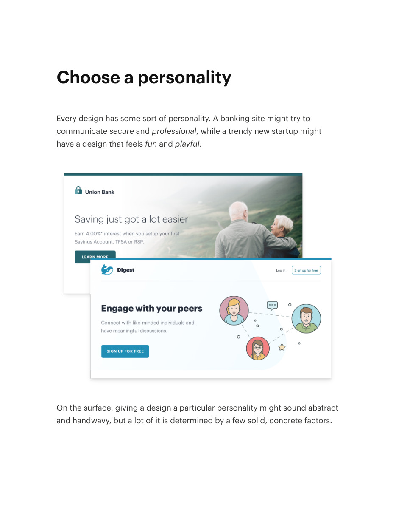
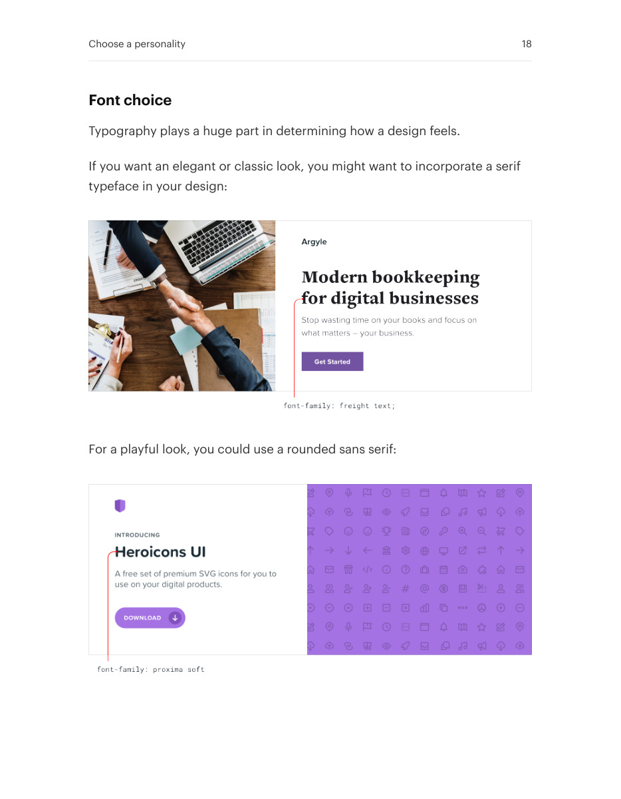
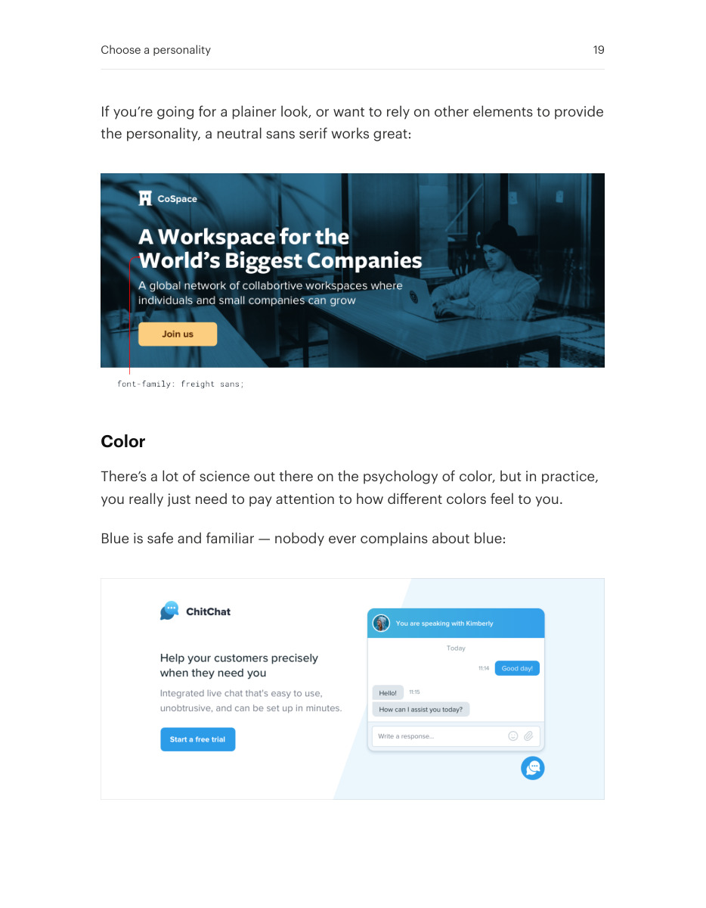
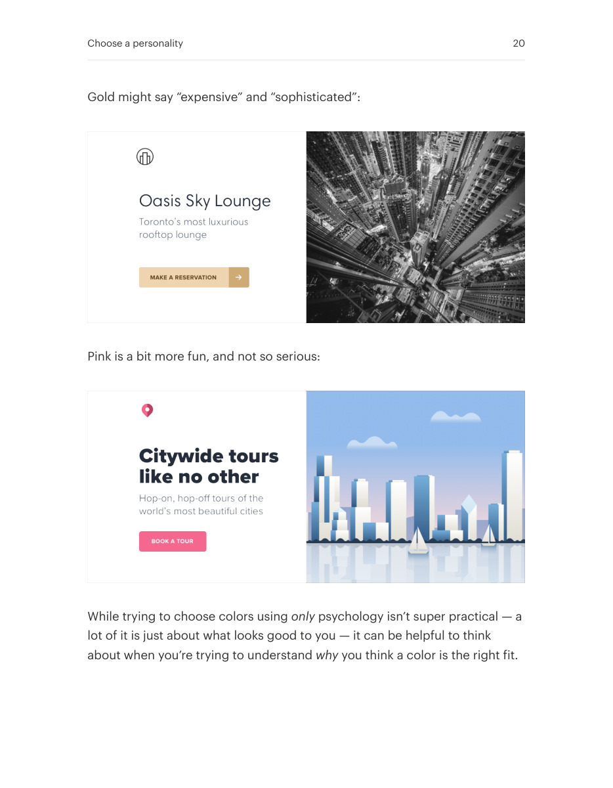
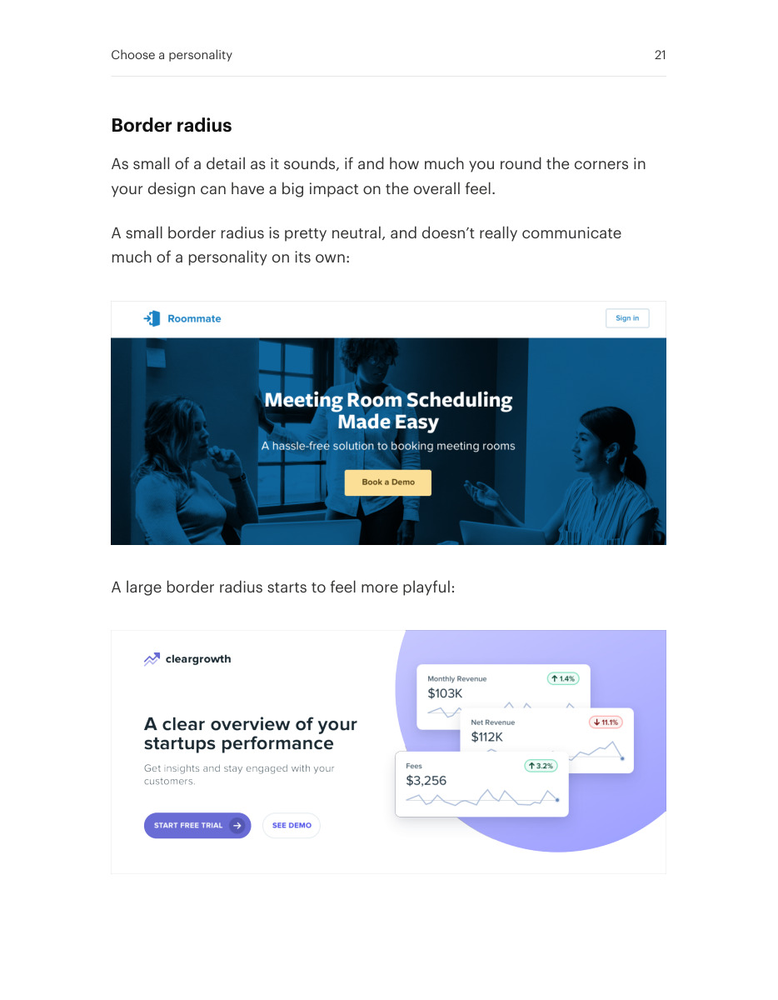
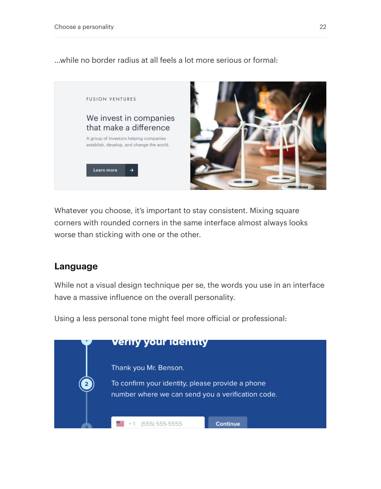
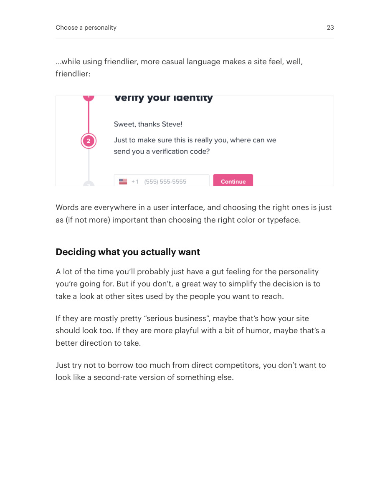

# Choose a consistent interface personality

## Apply this

- If a screen mixes incompatible moods, name the intended personality first.
- Align typeface, color, corner shape, and language with that personality.
- Compare representative controls together; keep established brand conventions unless there is a concrete mismatch.

## Source

Source: `Refactoring UI v1.0.2.pdf`, version 1.0.2, PDF pages 17–23.
Apply this is new guidance; the source blocks below preserve the supplied pypdf extraction verbatim.
Page images preserve the original visual content, including text absent from extraction.

### Source outline

- Choose a personality (source page 17)
  - Font choice (source page 18)
  - Color (source page 19)
  - Border radius (source page 21)
  - Language (source page 22)
  - Deciding what you actually want (source page 23)

## Source pages

### Source page 17



```text
Choose a personality
Every design has some sort of personality. A banking site might try to
communicatesecure andprofessional, while a trendy new startup might
have a design that feelsfun andplayful.
On the surface, giving a design a particular personality might sound abstract
and handwavy, but a lot of it is determined by a few solid, concrete factors.
```

### Source page 18



```text
Font choice
Typography plays a huge part in determining how a design feels.
If you want an elegant or classic look, you might want to incorporate a serif
typeface in your design:
For a playful look, you could use a rounded sans serif:
Choose a personality 18
```

### Source page 19



```text
If you’re going for a plainer look, or want to rely on other elements to provide
the personality, a neutral sans serif works great:
Color
There’s a lot of science out there on the psychology of color, but in practice,
you really just need to pay attention to how different colors feel to you.
Blue is safe and familiar — nobody ever complains about blue:
Choose a personality 19
```

### Source page 20



```text
Gold might say “expensive” and “sophisticated”:
Pink is a bit more fun, and not so serious:
While trying to choose colors usingonly psychology isn’t super practical — a
lot of it is just about what looks good to you — it can be helpful to think
about when you’re trying to understandwhy you think a color is the right fit.
Choose a personality 20
```

### Source page 21



```text
Border radius
As small of a detail as it sounds, if and how much you round the corners in
your design can have a big impact on the overall feel.
A small border radius is pretty neutral, and doesn’t really communicate
much of a personality on its own:
A large border radius starts to feel more playful:
Choose a personality 21
```

### Source page 22



```text
…while no border radius at all feels a lot more serious or formal:
Whatever you choose, it’s important to stay consistent. Mixing square
corners with rounded corners in the same interface almost always looks
worse than sticking with one or the other.
Language
While not a visual design technique per se, the words you use in an interface
have a massive influence on the overall personality.
Using a less personal tone might feel more official or professional:
Choose a personality 22
```

### Source page 23



```text
…while using friendlier, more casual language makes a site feel, well,
friendlier:
Words are everywhere in a user interface, and choosing the right ones is just
as (if not more) important than choosing the right color or typeface.
Deciding what you actually want
A lot of the time you’ll probably just have a gut feeling for the personality
you’re going for. But if you don’t, a great way to simplify the decision is to
take a look at other sites used by the people you want to reach.
If they are mostly pretty “serious business”, maybe that’s how your site
should look too. If they are more playful with a bit of humor, maybe that’s a
better direction to take.
Just try not to borrow too much from direct competitors, you don’t want to
look like a second-rate version of something else.
Choose a personality 23
```
