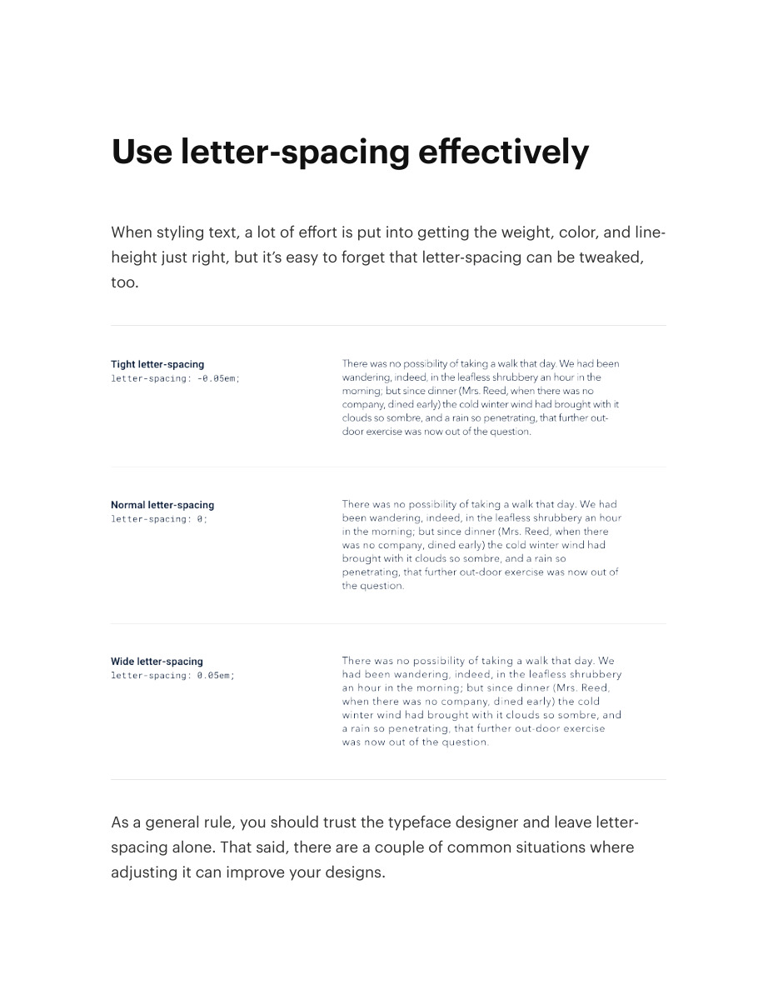
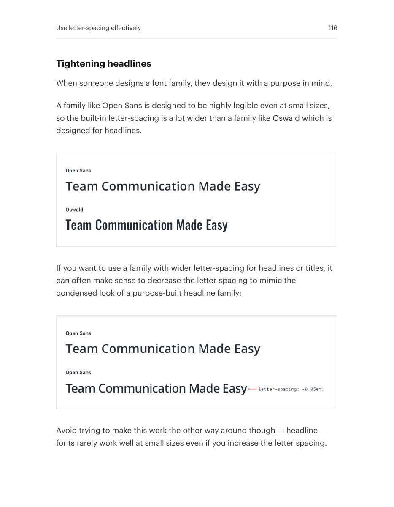
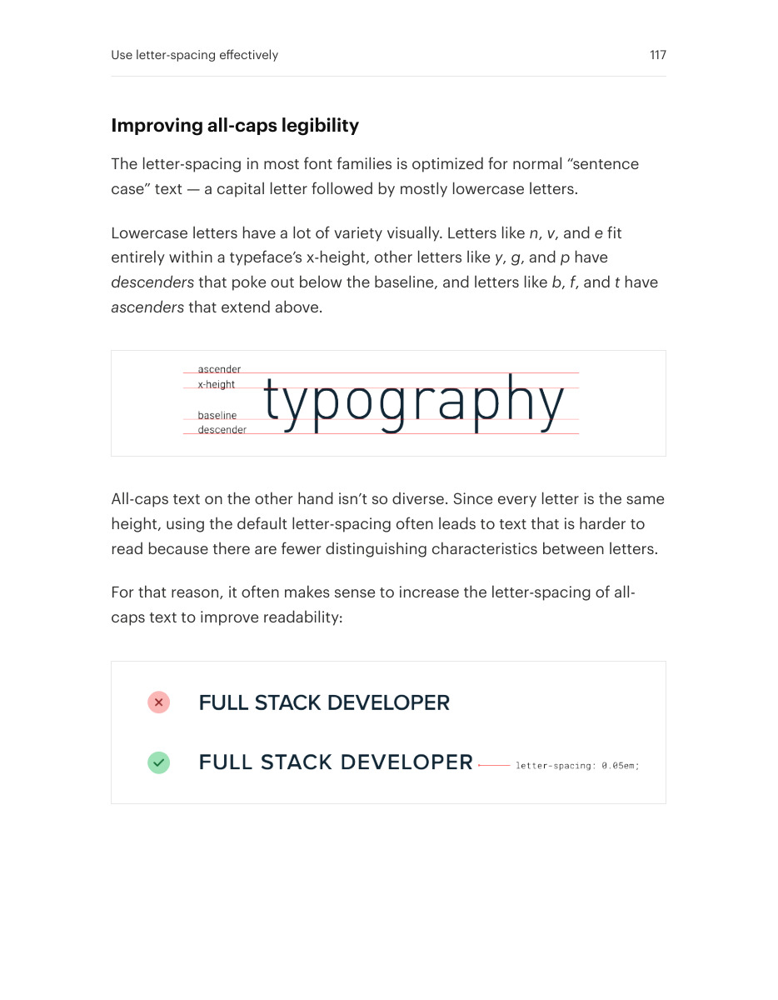

# Tune letter spacing deliberately

## Apply this

- If headings look loose or capitals crowded, inspect the actual typeface at its intended size.
- Try tighter tracking for large headlines and slightly wider tracking for uppercase labels.
- Do not apply one tracking value globally; check small text and localization before shipping.

## Source

Source: `Refactoring UI v1.0.2.pdf`, version 1.0.2, PDF pages 115–117.
Apply this is new guidance; the source blocks below preserve the supplied pypdf extraction verbatim.
Page images preserve the original visual content, including text absent from extraction.

### Source outline

- Use letter-spacing effectively (source page 115)
  - Tightening headlines (source page 116)
  - Improving all-caps legibility (source page 117)

## Source pages

### Source page 115



```text
Use letter-spacing effectively
When styling text, a lot of effort is put into getting the weight, color, and line-
height just right, but it’s easy to forget that letter-spacing can be tweaked,
too.
As a general rule, you should trust the typeface designer and leave letter-
spacing alone. That said, there are a couple of common situations where
adjusting it can improve your designs.
```

### Source page 116



```text
Tightening headlines
When someone designs a font family, they design it with a purpose in mind.
A family like Open Sans is designed to be highly legible even at small sizes,
so the built-in letter-spacing is a lot wider than a family like Oswald which is
designed for headlines.
If you want to use a family with wider letter-spacing for headlines or titles, it
can often make sense to decrease the letter-spacing to mimic the
condensed look of a purpose-built headline family:
Avoid trying to make this work the other way around though — headline
fonts rarely work well at small sizes even if you increase the letter spacing.
Use letter-spacing effectively 116
```

### Source page 117



```text
Improving all-caps legibility
The letter-spacing in most font families is optimized for normal “sentence
case” text — a capital letter followed by mostly lowercase letters.
Lowercase letters have a lot of variety visually. Letters liken,v, ande fit
entirely within a typeface’s x-height, other letters likey,g, andp have
descenders that poke out below the baseline, and letters likeb,f, andt have
ascenders that extend above.
All-caps text on the other hand isn’t so diverse. Since every letter is the same
height, using the default letter-spacing often leads to text that is harder to
read because there are fewer distinguishing characteristics between letters.
For that reason, it often makes sense to increase the letter-spacing of all-
caps text to improve readability:
Use letter-spacing effectively 117
```
