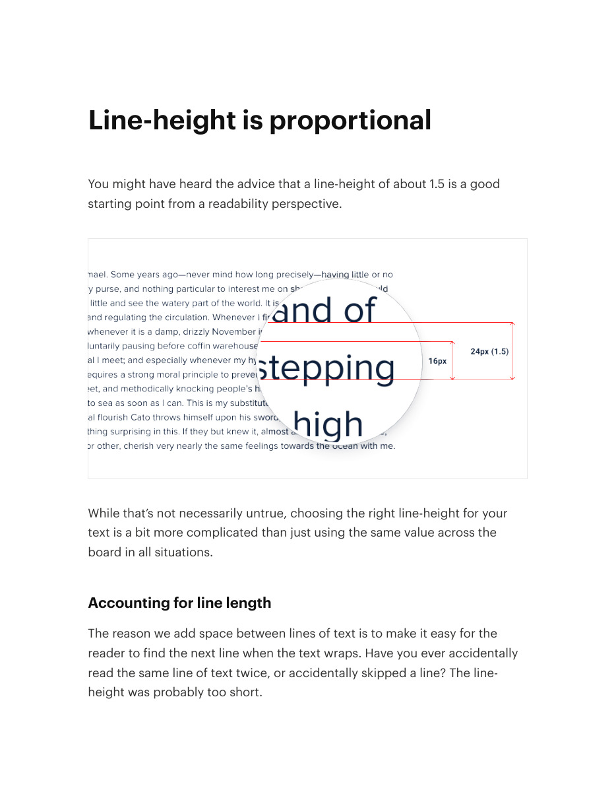
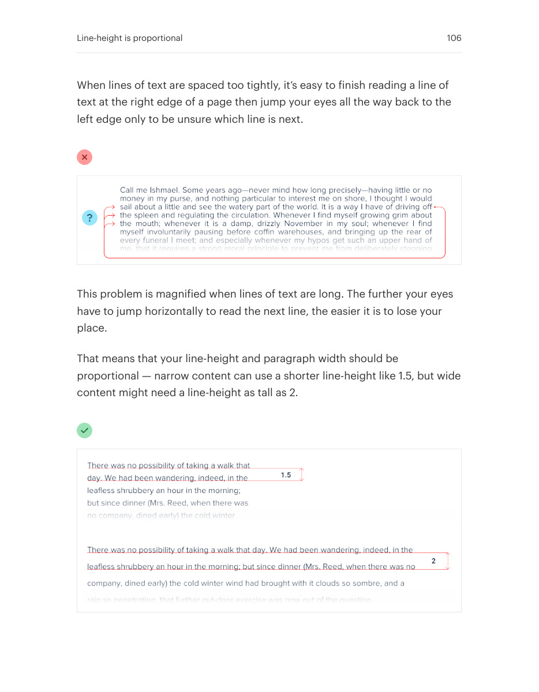
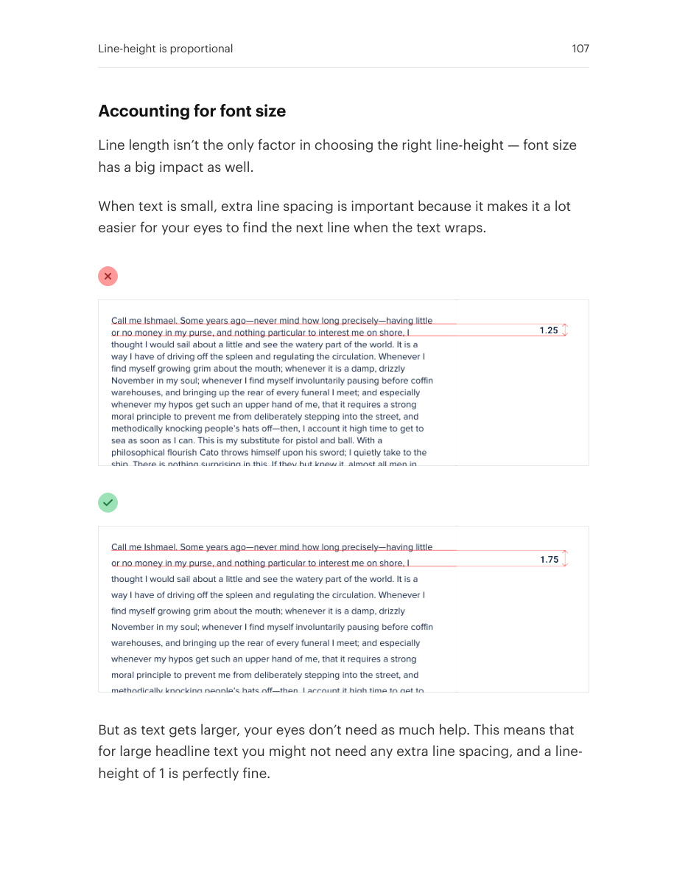
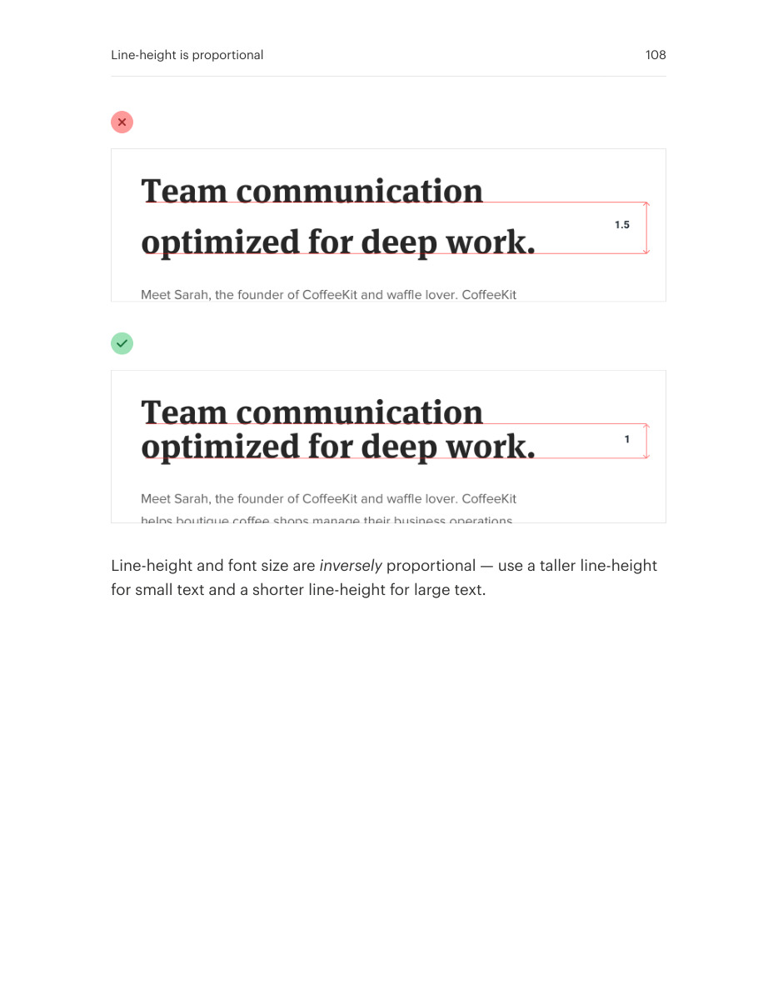

# Adjust line height to reading conditions

## Apply this

- If text feels crowded or disconnected, evaluate both size and line length.
- Use more line height for smaller text and longer lines; tighten large headings carefully.
- Check multi-line wrapping with real content instead of reusing one ratio everywhere.

## Source

Source: `Refactoring UI v1.0.2.pdf`, version 1.0.2, PDF pages 105–108.
Apply this is new guidance; the source blocks below preserve the supplied pypdf extraction verbatim.
Page images preserve the original visual content, including text absent from extraction.

### Source outline

- Line-height is proportional (source page 105)
  - Accounting for line length (source page 105)
  - Accounting for font size (source page 107)

## Source pages

### Source page 105



```text
Line-height is proportional
You might have heard the advice that a line-height of about 1.5 is a good
starting point from a readability perspective.
While that’s not necessarily untrue, choosing the right line-height for your
text is a bit more complicated than just using the same value across the
board in all situations.
Accounting for line length
The reason we add space between lines of text is to make it easy for the
reader to find the next line when the text wraps. Have you ever accidentally
read the same line of text twice, or accidentally skipped a line? The line-
height was probably too short.
```

### Source page 106



```text
When lines of text are spaced too tightly, it’s easy to finish reading a line of
text at the right edge of a page then jump your eyes all the way back to the
left edge only to be unsure which line is next.
This problem is magnified when lines of text are long. The further your eyes
have to jump horizontally to read the next line, the easier it is to lose your
place.
That means that your line-height and paragraph width should be
proportional — narrow content can use a shorter line-height like 1.5, but wide
content might need a line-height as tall as 2.
Line-height is proportional 106
```

### Source page 107



```text
Accounting for font size
Line length isn’t the only factor in choosing the right line-height — font size
has a big impact as well.
When text is small, extra line spacing is important because it makes it a lot
easier for your eyes to find the next line when the text wraps.
But as text gets larger, your eyes don’t need as much help. This means that
for large headline text you might not need any extra line spacing, and a line-
height of 1 is perfectly fine.
Line-height is proportional 107
```

### Source page 108



```text
Line-height and font size areinversely proportional — use a taller line-height
for small text and a shorter line-height for large text.
Line-height is proportional 108
```
