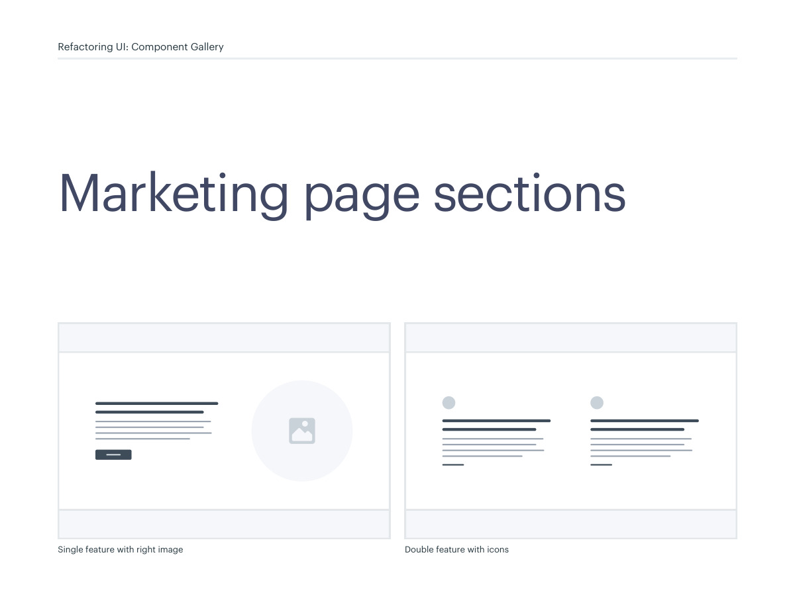
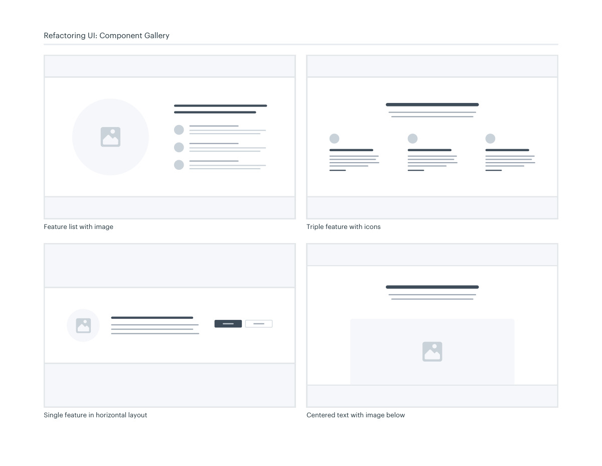
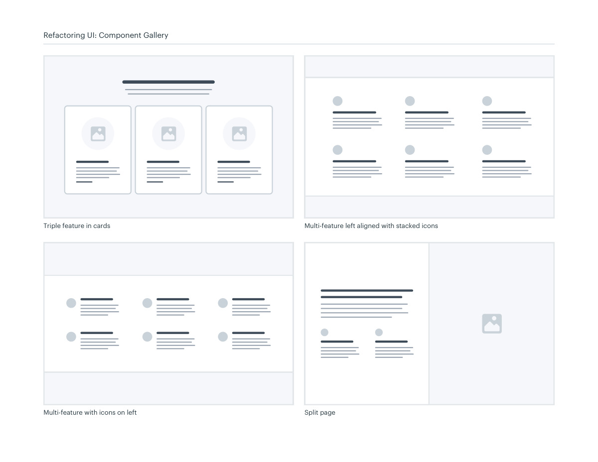
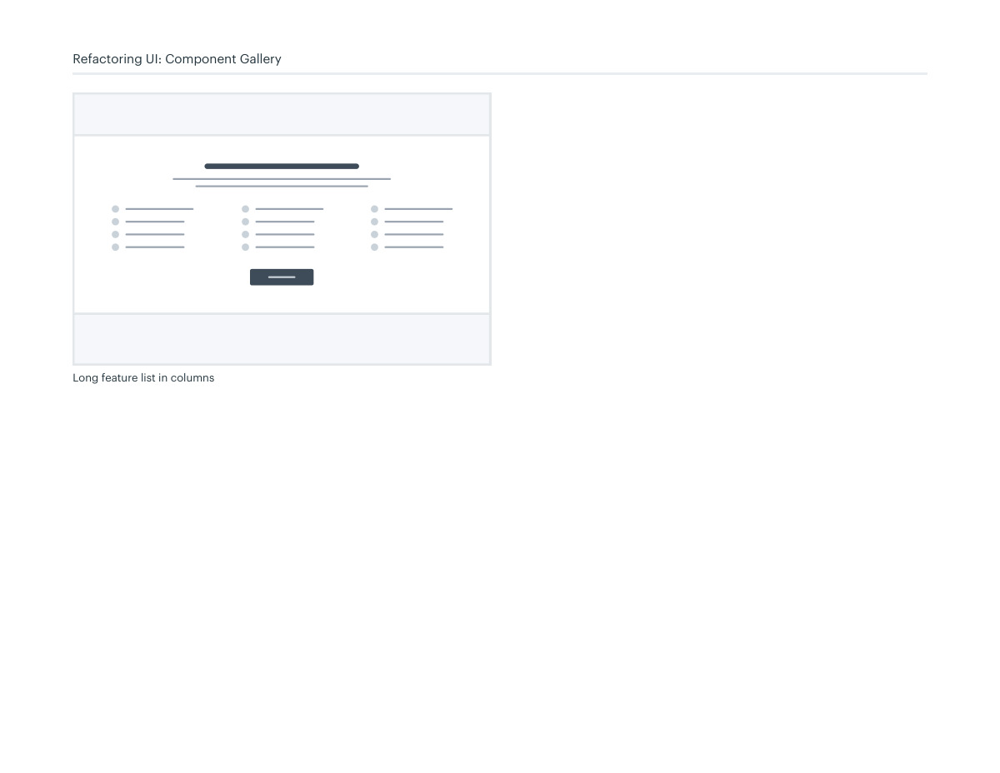

# Marketing feature sections

## Apply this

- If a feature list feels repetitive, group benefits by the question they answer.
- Compare single-feature splits, icon lists, and restrained cards for each group.
- Check reading order and real text length; avoid alternating layouts that confuse the narrative.

## Source

Source: `Component Gallery v1.1.0.pdf`, version 1.1.0, PDF pages 52–55.
Apply this is new guidance; the source blocks below preserve the supplied pypdf extraction verbatim.
Page images preserve the original visual content, including text absent from extraction.

## Source pages

### Source page 52



```text
Single feature with right image Double feature with icons
Marketing page sections
Refactoring UI: Component Gallery
```

### Source page 53



```text
Refactoring UI: Component Gallery
Feature list with image Triple feature with icons
Single feature in horizontal layout Centered text with image below
```

### Source page 54



```text
Refactoring UI: Component Gallery
Triple feature in cards
Split page
Multi-feature left aligned with stacked icons
Multi-feature with icons on left
```

### Source page 55



```text
Refactoring UI: Component Gallery
Long feature list in columns
```
