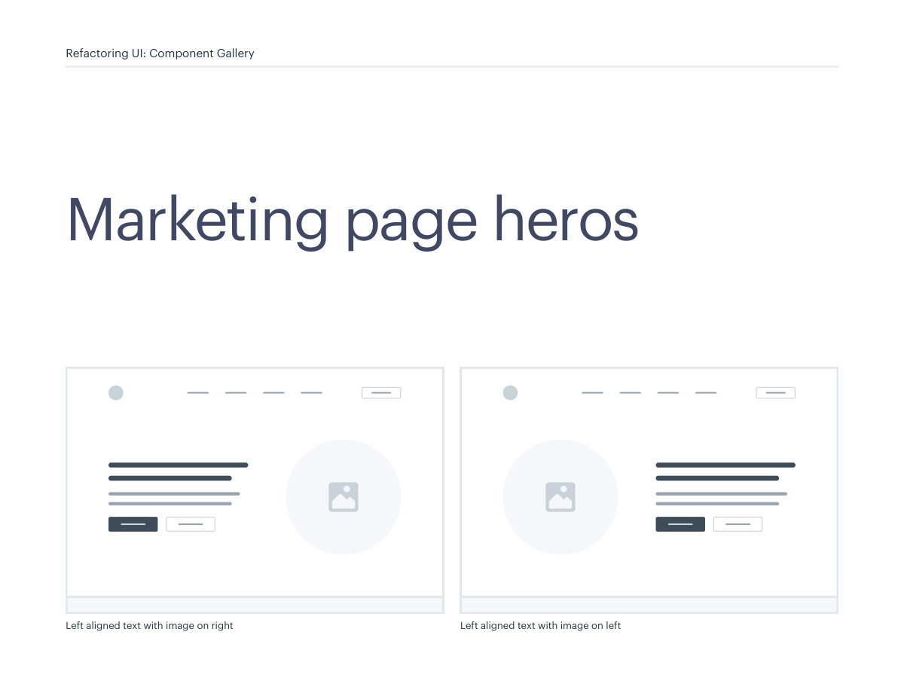
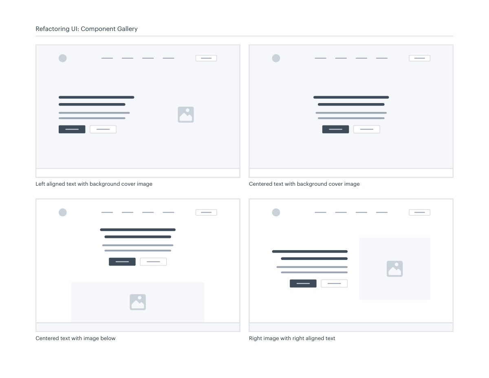
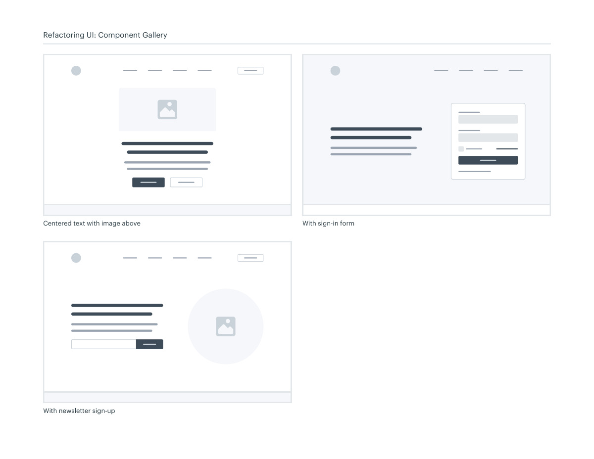

# Marketing hero layouts

## Apply this

- If the opening section lacks a clear next step, pair one proposition with one primary action.
- Compare centered, split-image, background-image, and form-led arrangements.
- Check narrow screens and image-backed contrast; do not let decorative imagery push the action out of view.

## Source

Source: `Component Gallery v1.1.0.pdf`, version 1.1.0, PDF pages 48–51.
Apply this is new guidance; the source blocks below preserve the supplied pypdf extraction verbatim.
Page images preserve the original visual content, including text absent from extraction.

## Source pages

### Source page 48



```text
Left aligned text with image on right
 Left aligned text with image on left
Marketing page heros
Refactoring UI: Component Gallery
```

### Source page 49



```text
Refactoring UI: Component Gallery
Left aligned text with background cover image
 Centered text with background cover image
Centered text with image below
 Right image with right aligned text
```

### Source page 50



```text
Refactoring UI: Component Gallery
With sign-in form
Centered text with image above
With newsletter sign-up
```

### Source page 51


```text

```
