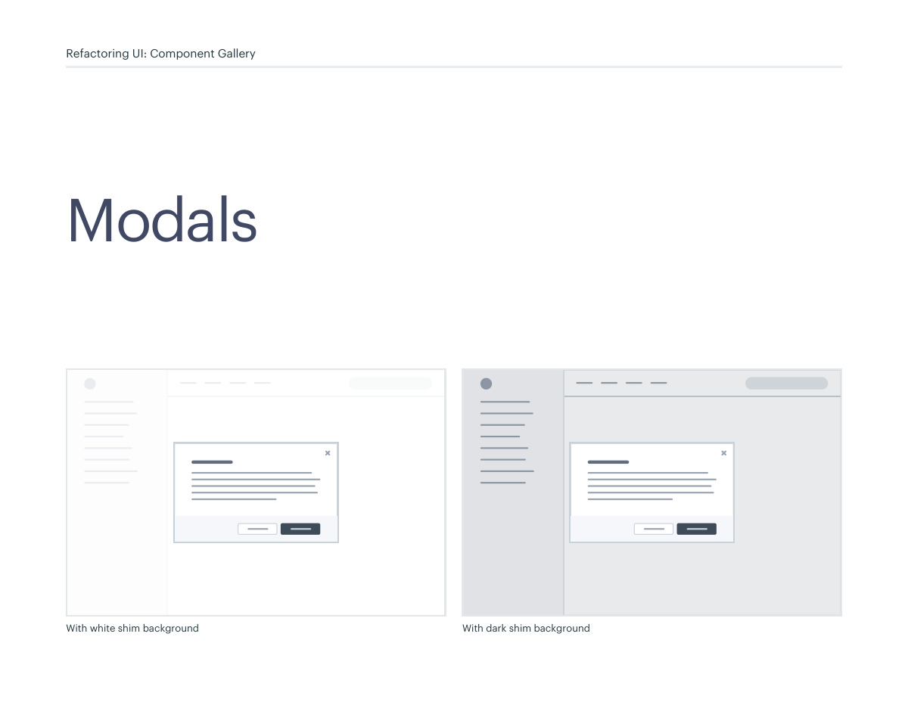
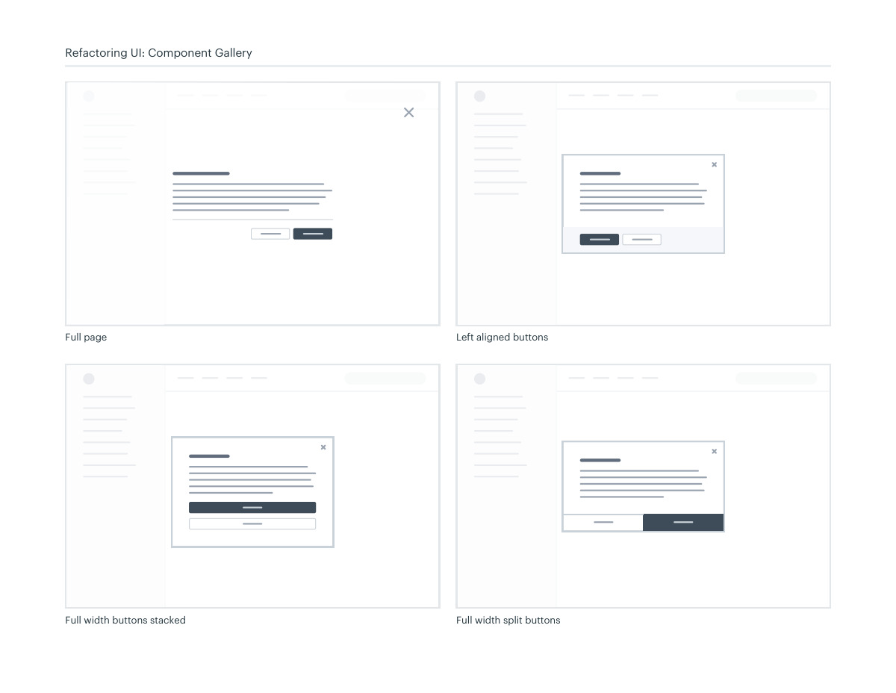

# Modal composition

## Apply this

- If a dialog feels cramped or unclear, separate its purpose, content, and decision area.
- Choose an appropriate width and consistent button arrangement with a readable backdrop.
- Verify focus trapping, escape behavior, return focus, and small-screen fit; destructive decisions need explicit context.

## Source

Source: `Component Gallery v1.1.0.pdf`, version 1.1.0, PDF pages 56–57.
Apply this is new guidance; the source blocks below preserve the supplied pypdf extraction verbatim.
Page images preserve the original visual content, including text absent from extraction.

## Source pages

### Source page 56



```text
Modals
Refactoring UI: Component Gallery
With white shim background
 With dark shim background
```

### Source page 57



```text
Refactoring UI: Component Gallery
Full page
Full width buttons stacked Full width split buttons
Left aligned buttons
```
