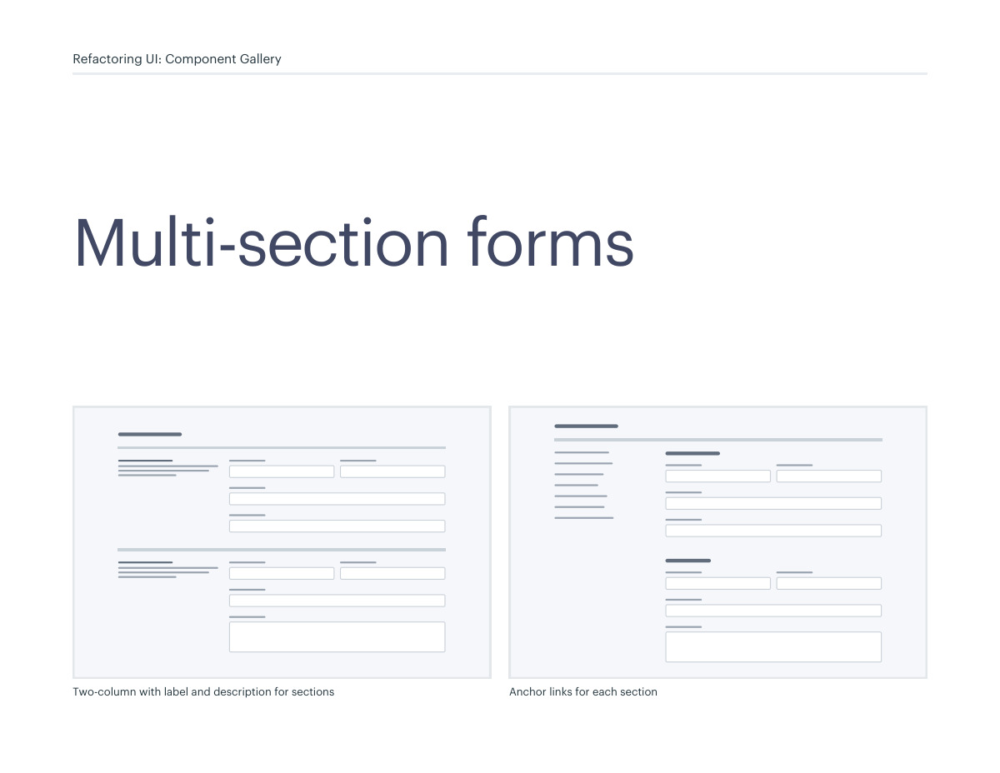
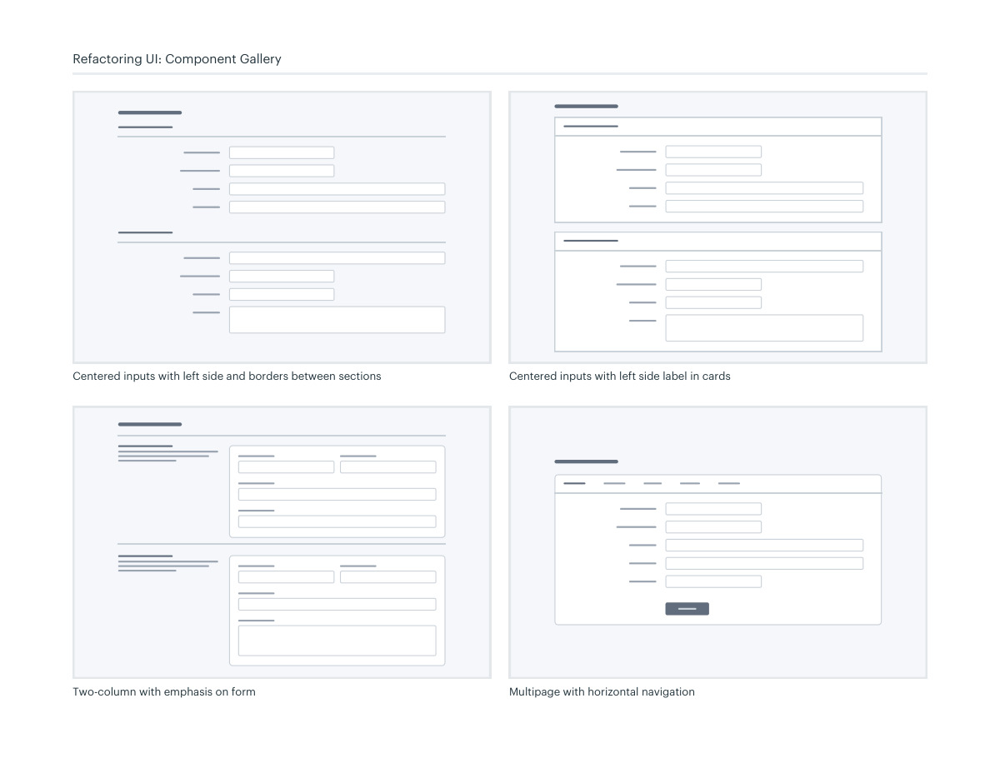
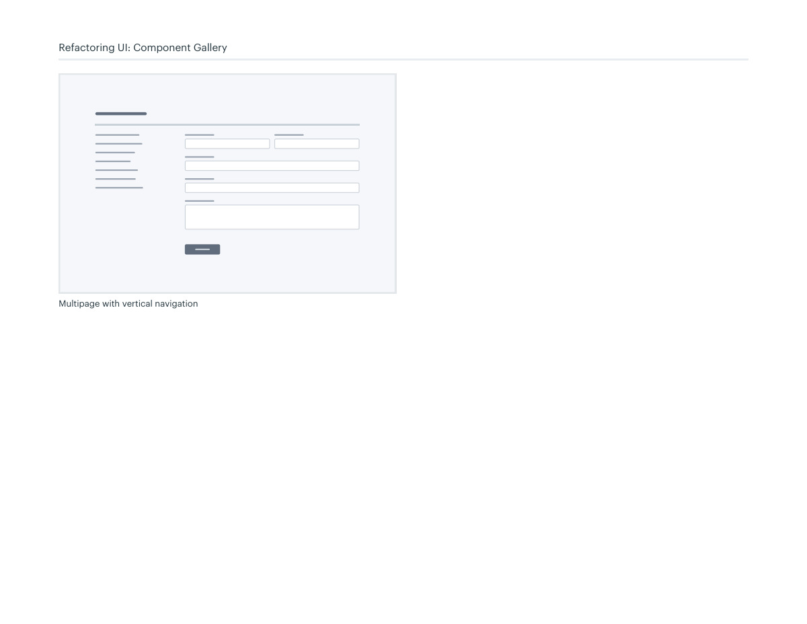

# Multi-section form layouts

## Apply this

- If a long form is hard to navigate, group fields into meaningful sections.
- Compare side labels, cards, anchors, or multiple steps according to dependencies.
- Preserve entered data and validation across sections; split steps only when they reduce cognitive load.

## Source

Source: `Component Gallery v1.1.0.pdf`, version 1.1.0, PDF pages 58–61.
Apply this is new guidance; the source blocks below preserve the supplied pypdf extraction verbatim.
Page images preserve the original visual content, including text absent from extraction.

## Source pages

### Source page 58



```text
Two-column with label and description for sections Anchor links for each section
Multi-section forms
Refactoring UI: Component Gallery
```

### Source page 59



```text
Centered inputs with left side label in cardsCentered inputs with left side and borders between sections
Multipage with horizontal navigation
Two-column with emphasis on form
Refactoring UI: Component Gallery
```

### Source page 60



```text
Refactoring UI: Component Gallery
Multipage with vertical navigation
```

### Source page 61


```text

```
