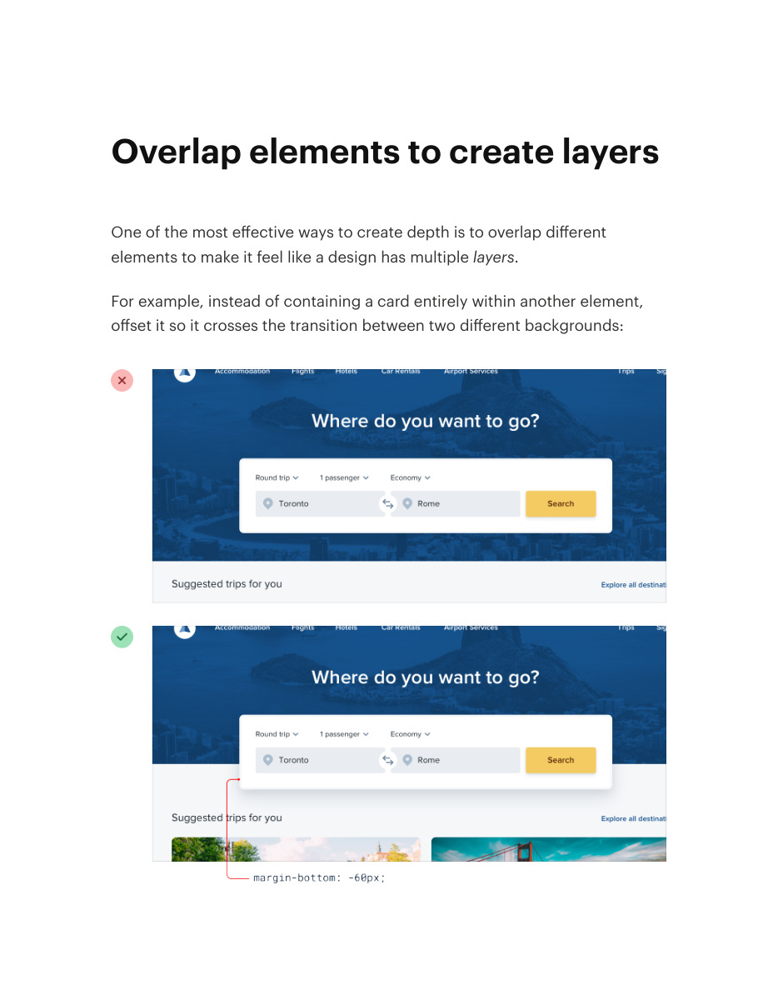
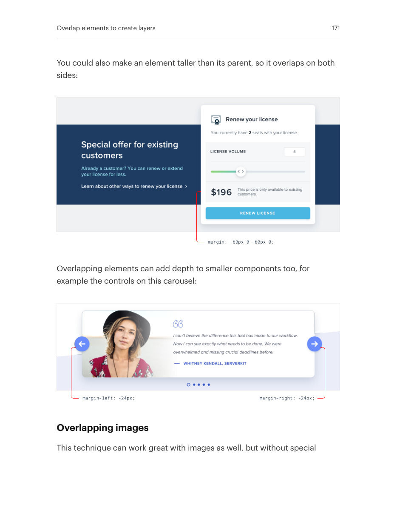
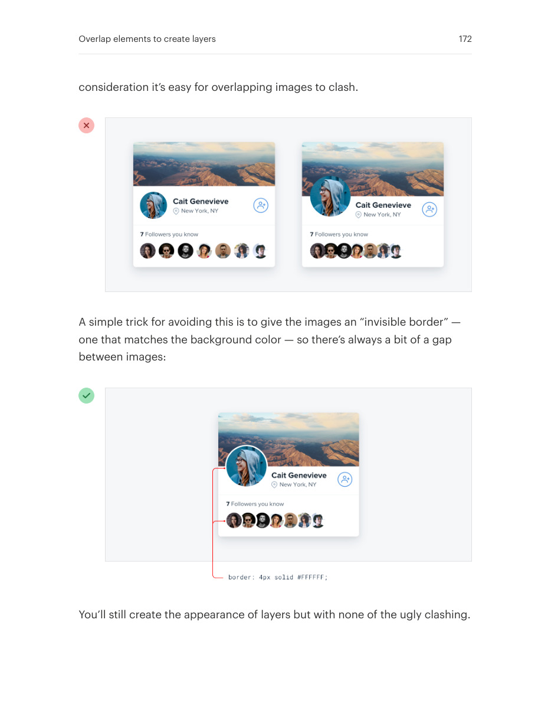

# Use overlap to establish layers

## Apply this

- If adjacent sections feel disconnected, try a controlled overlap.
- Bridge backgrounds with cards or images while retaining clear content boundaries.
- Check small screens, clipping, and image contrast; overlap must not hide actions or text.

## Source

Source: `Refactoring UI v1.0.2.pdf`, version 1.0.2, PDF pages 170–172.
Apply this is new guidance; the source blocks below preserve the supplied pypdf extraction verbatim.
Page images preserve the original visual content, including text absent from extraction.

### Source outline

- Overlap elements to create layers (source page 170)
  - Overlapping images (source page 171)

## Source pages

### Source page 170



```text
Overlap elements to create layers
One of the most effective ways to create depth is to overlap different
elements to make it feel like a design has multiplelayers.
For example, instead of containing a card entirely within another element,
offset it so it crosses the transition between two different backgrounds:

```

### Source page 171



```text
You could also make an element taller than its parent, so it overlaps on both
sides:
Overlapping elements can add depth to smaller components too, for
example the controls on this carousel:
Overlapping images
This technique can work great with images as well, but without special
Overlap elements to create layers 171
```

### Source page 172



```text
consideration it’s easy for overlapping images to clash.
A simple trick for avoiding this is to give the images an “invisible border” —
one that matches the background color — so there’s always a bit of a gap
between images:
You’ll still create the appearance of layers but with none of the ugly clashing.
Overlap elements to create layers 172
```
