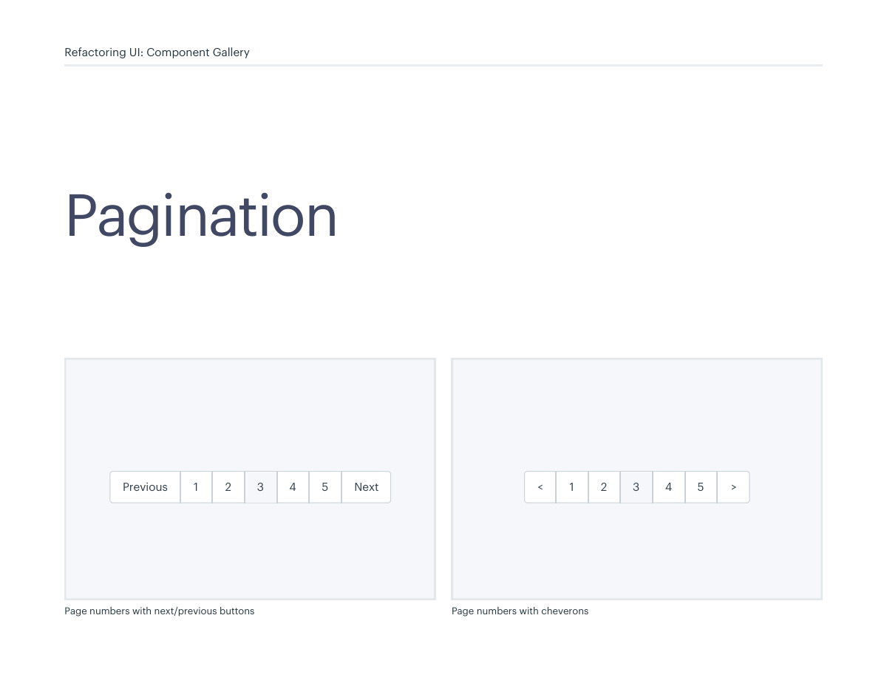
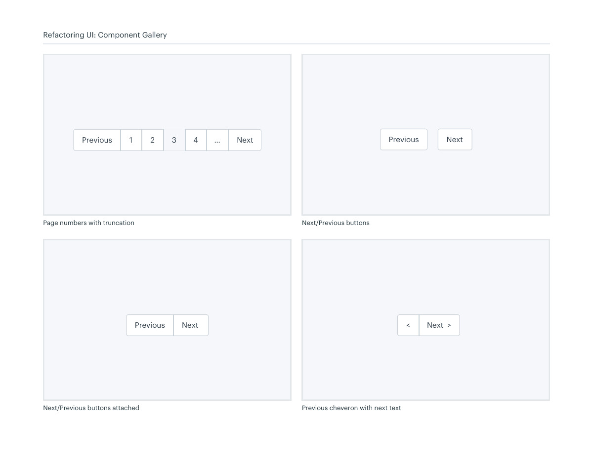
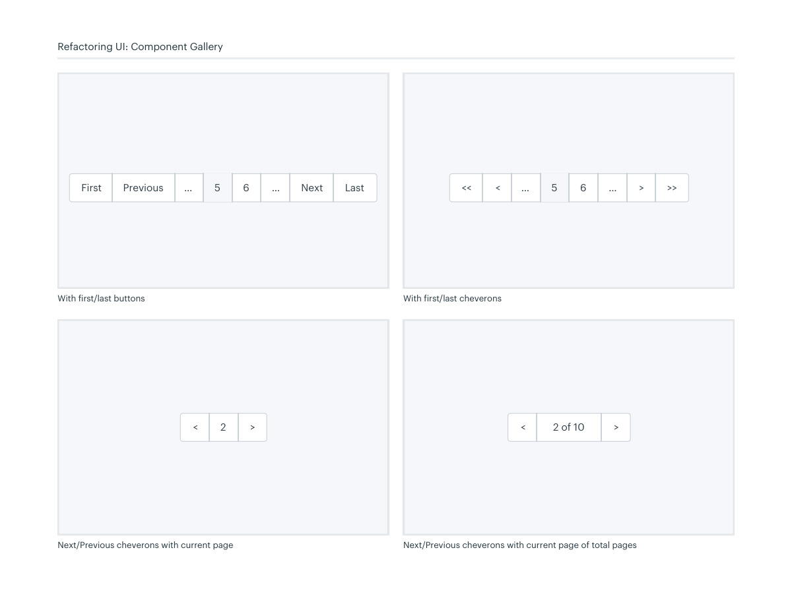
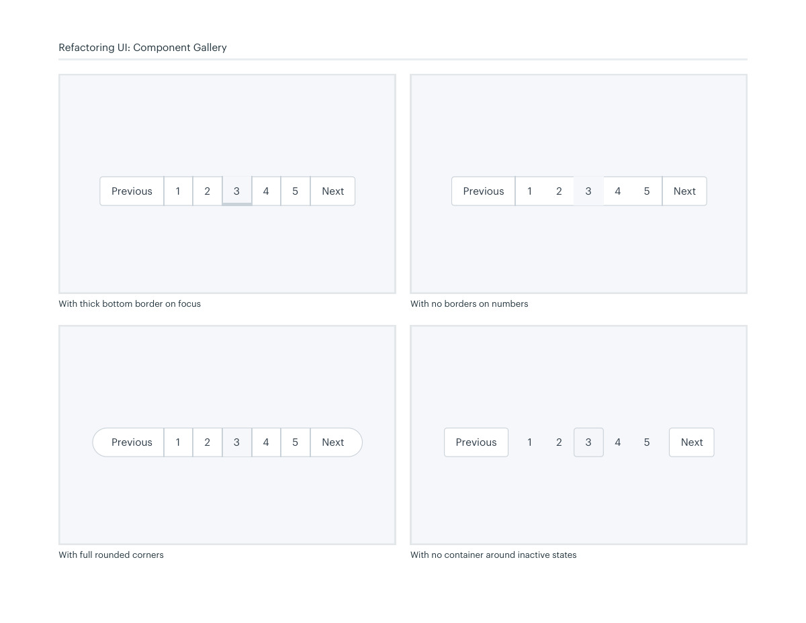
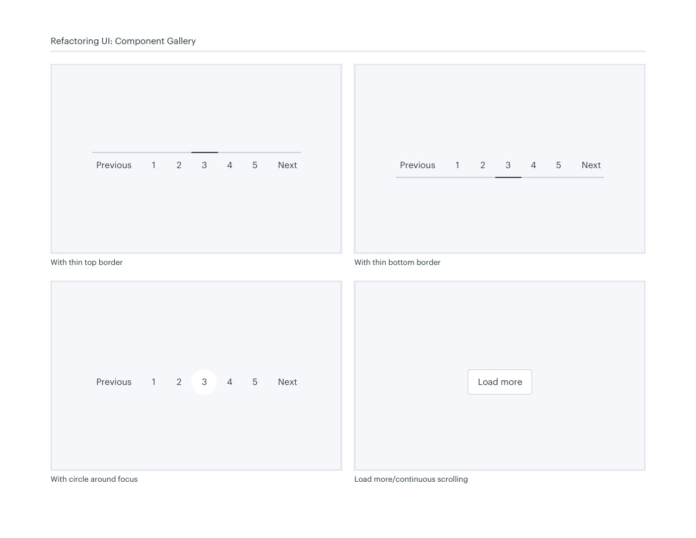

# Pagination controls

## Apply this

- If long lists are hard to navigate, select pagination that fits the browsing task.
- Compare numbered pages, next/previous controls, truncation, and load-more behavior.
- Keep current and disabled states clear; test keyboard access and meaningful result announcements.

## Source

Source: `Component Gallery v1.1.0.pdf`, version 1.1.0, PDF pages 22–27.
Apply this is new guidance; the source blocks below preserve the supplied pypdf extraction verbatim.
Page images preserve the original visual content, including text absent from extraction.

## Source pages

### Source page 22



```text
Pagination
Page numbers with next/previous buttons
1 2 3 4 5 NextPrevious
Refactoring UI: Component Gallery
Page numbers with cheverons
1 2 3 4 5 ><
```

### Source page 23



```text
Refactoring UI: Component Gallery
Page numbers with truncation
Next/Previous buttons attached
NextPrevious
Previous cheveron with next text
Next  ><
Next/Previous buttons
NextPrevious
1 2 3 4 … NextPrevious
```

### Source page 24



```text
Refactoring UI: Component Gallery
With first/last buttons
Next/Previous cheverons with current page Next/Previous cheverons with current page of total pages
2 ><
 2 of 10 ><
With first/last cheverons
5 …… 6 Next LastPreviousFirst
 5 … > >>… 6<<<
```

### Source page 25



```text
Refactoring UI: Component Gallery
With no borders on numbers
With no container around inactive states With full rounded corners
With thick bottom border on focus
1 2 3 4 5 NextPrevious
1 2 3 4 5 NextPrevious
1 2 3 4 5 NextPrevious
1 2 3 4 5 NextPrevious
```

### Source page 26



```text
Refactoring UI: Component Gallery
Load more/continuous scrollingWith circle around focus
With thin top border With thin bottom border
Load more1 2 3 4 5 NextPrevious
1 2 3 4 5 NextPrevious
 1 2 3 4 5 NextPrevious
```

### Source page 27


```text

```
