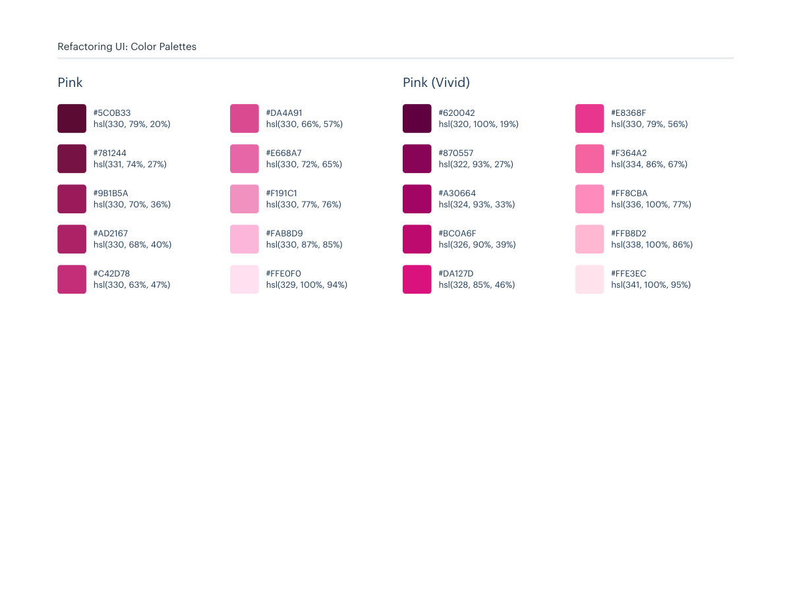
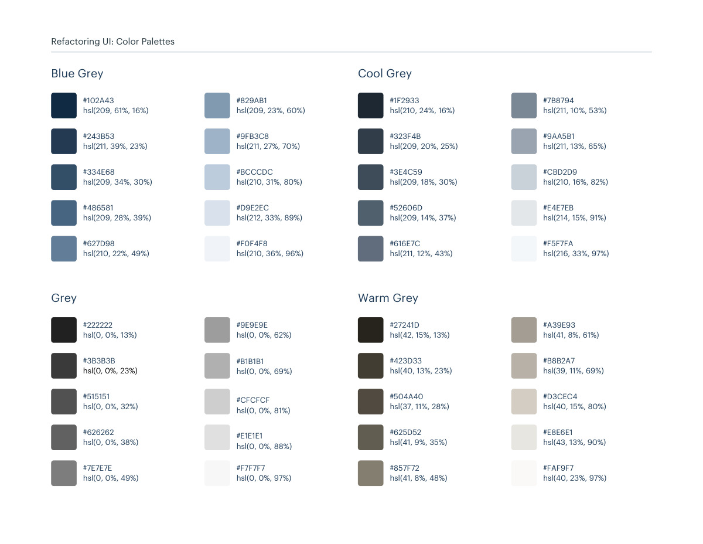

# Pink and neutral swatches

## Apply this

- If you need to extend an existing color system, compare the pink and neutral swatches in these pages.
- Select a coherent shade family and map it to existing semantic token roles; preserve palette-specific variants separately.
- Verify foreground/background contrast and temperature across components; same-named shades in a palette may differ from this swatch catalog.

## Source

Source: `Color Palettes v1.1.0.pdf`, version 1.1.0, PDF pages 151–152.
Apply this is new guidance; the source blocks below preserve the supplied pypdf extraction verbatim.
Page images preserve the original visual content, including text absent from extraction.

Palette originals retain source comments and trailing commas (JSONC), despite their `.json` extension.
The `.strict.json` companion removes only that syntax; keys and values remain unchanged.
- [swatches.json](../assets/swatches.json)
- [swatches.strict.json](../assets/swatches.strict.json)

## Source pages

### Source page 151



```text
Refactoring UI: Color Palettes
hsl(330, 79%, 20%)
#5C0B33
hsl(331, 74%, 27%)
#781244
hsl(330, 70%, 36%)
#9B1B5A
hsl(330, 68%, 40%)
#AD2167
hsl(330, 63%, 47%)
#C42D78
hsl(330, 66%, 57%)
#DA4A91
hsl(330, 72%, 65%)
#E668A7
hsl(330, 77%, 76%)
#F191C1
hsl(330, 87%, 85%)
#FAB8D9
hsl(329, 100%, 94%)
#FFE0F0
Pink
hsl(320, 100%, 19%)
#620042
hsl(322, 93%, 27%)
#870557
hsl(324, 93%, 33%)
#A30664
hsl(326, 90%, 39%)
#BC0A6F
hsl(328, 85%, 46%)
#DA127D
hsl(330, 79%, 56%)
#E8368F
hsl(334, 86%, 67%)
#F364A2
hsl(336, 100%, 77%)
#FF8CBA
hsl(338, 100%, 86%)
#FFB8D2
hsl(341, 100%, 95%)
#FFE3EC
Pink (Vivid)
```

### Source page 152



```text
Refactoring UI: Color Palettes
hsl(209, 61%, 16%)
#102A43
hsl(211, 39%, 23%)
#243B53
hsl(209, 34%, 30%)
#334E68
hsl(209, 28%, 39%)
#486581
hsl(210, 22%, 49%)
#627D98
Blue Grey
hsl(209, 23%, 60%)
#829AB1
hsl(211, 27%, 70%)
#9FB3C8
hsl(210, 31%, 80%)
#BCCCDC
hsl(212, 33%, 89%)
#D9E2EC
hsl(210, 36%, 96%)
#F0F4F8
hsl(210, 24%, 16%)
#1F2933
hsl(209, 20%, 25%)
#323F4B
hsl(209, 18%, 30%)
#3E4C59
hsl(209, 14%, 37%)
#52606D
hsl(211, 12%, 43%)
#616E7C
hsl(211, 10%, 53%)
#7B8794
hsl(211, 13%, 65%)
#9AA5B1
hsl(210, 16%, 82%)
#CBD2D9
hsl(214, 15%, 91%)
#E4E7EB
hsl(216, 33%, 97%)
#F5F7FA
Cool Grey
hsl(0, 0%, 13%)
#222222
hsl(0, 0%, 23%)
#3B3B3B
hsl(0, 0%, 32%)
#515151
hsl(0, 0%, 38%)
#626262
hsl(0, 0%, 49%)
#7E7E7E
hsl(0, 0%, 62%)
#9E9E9E
hsl(0, 0%, 69%)
#B1B1B1
hsl(0, 0%, 81%)
#CFCFCF
hsl(0, 0%, 88%)
#E1E1E1
hsl(0, 0%, 97%)
#F7F7F7
Grey
hsl(42, 15%, 13%)
#27241D
hsl(40, 13%, 23%)
#423D33
hsl(37, 11%, 28%)
#504A40
hsl(41, 9%, 35%)
#625D52
hsl(41, 8%, 48%)
#857F72
hsl(43, 13%, 90%)
#E8E6E1
hsl(41, 8%, 61%)
#A39E93
hsl(39, 11%, 69%)
#B8B2A7
hsl(40, 15%, 80%)
#D3CEC4
hsl(40, 23%, 97%)
#FAF9F7
Warm Grey
```
