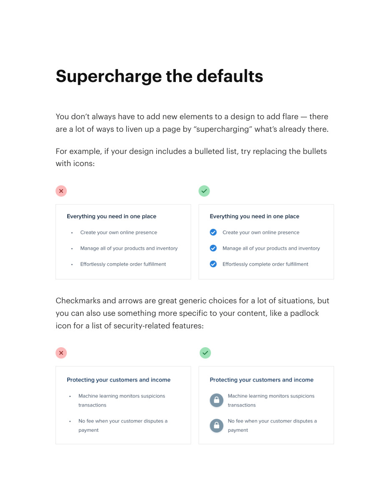
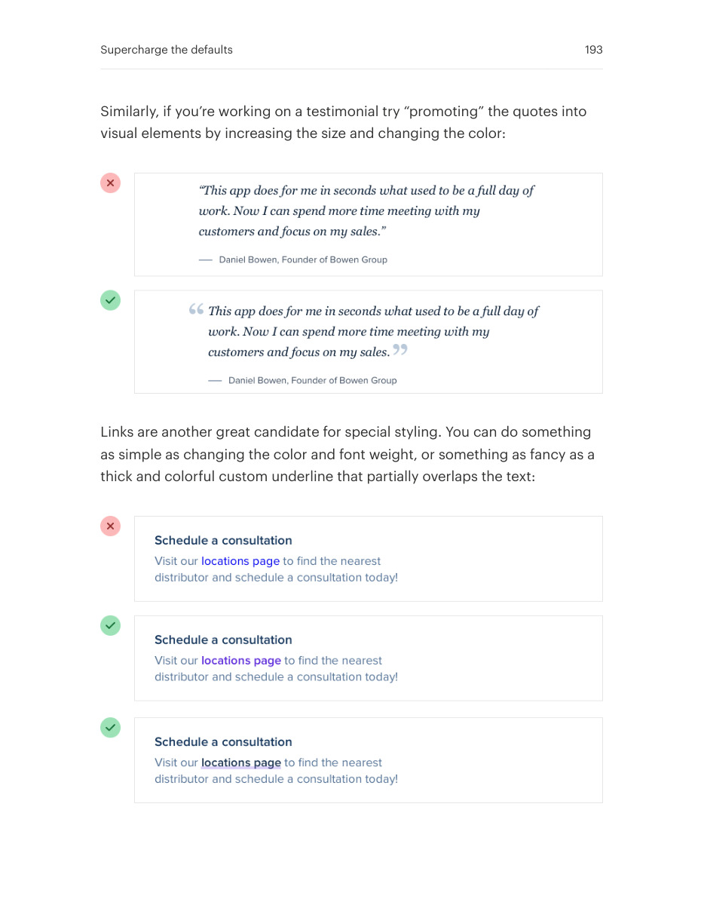
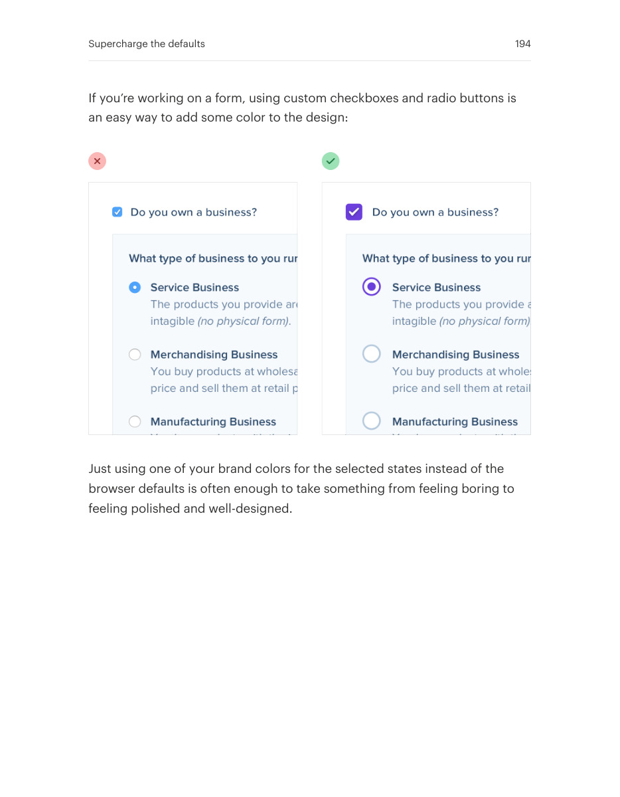

# Upgrade default-looking elements

## Apply this

- If a screen feels unfinished, inspect bullets, quotes, links, and controls before adding decoration.
- Give small default elements a purposeful shape, color, or typographic treatment.
- Preserve familiar meaning and accessible interaction; ornament should support the content.

## Source

Source: `Refactoring UI v1.0.2.pdf`, version 1.0.2, PDF pages 191–194.
Apply this is new guidance; the source blocks below preserve the supplied pypdf extraction verbatim.
Page images preserve the original visual content, including text absent from extraction.

### Source outline

- Finishing Touches (source page 191)
- Supercharge the defaults (source page 192)

## Source pages

### Source page 191


```text
Finishing Touches
```

### Source page 192



```text
Supercharge the defaults
You don’t always have to add new elements to a design to add flare — there
are a lot of ways to liven up a page by “supercharging” what’s already there.
For example, if your design includes a bulleted list, try replacing the bullets
with icons:
Checkmarks and arrows are great generic choices for a lot of situations, but
you can also use something more specific to your content, like a padlock
icon for a list of security-related features:

```

### Source page 193



```text
Similarly, if you’re working on a testimonial try “promoting” the quotes into
visual elements by increasing the size and changing the color:
Links are another great candidate for special styling. You can do something
as simple as changing the color and font weight, or something as fancy as a
thick and colorful custom underline that partially overlaps the text:
Supercharge the defaults 193
```

### Source page 194



```text
If you’re working on a form, using custom checkboxes and radio buttons is
an easy way to add some color to the design:
Just using one of your brand colors for the selected states instead of the
browser defaults is often enough to take something from feeling boring to
feeling polished and well-designed.
Supercharge the defaults 194
```
