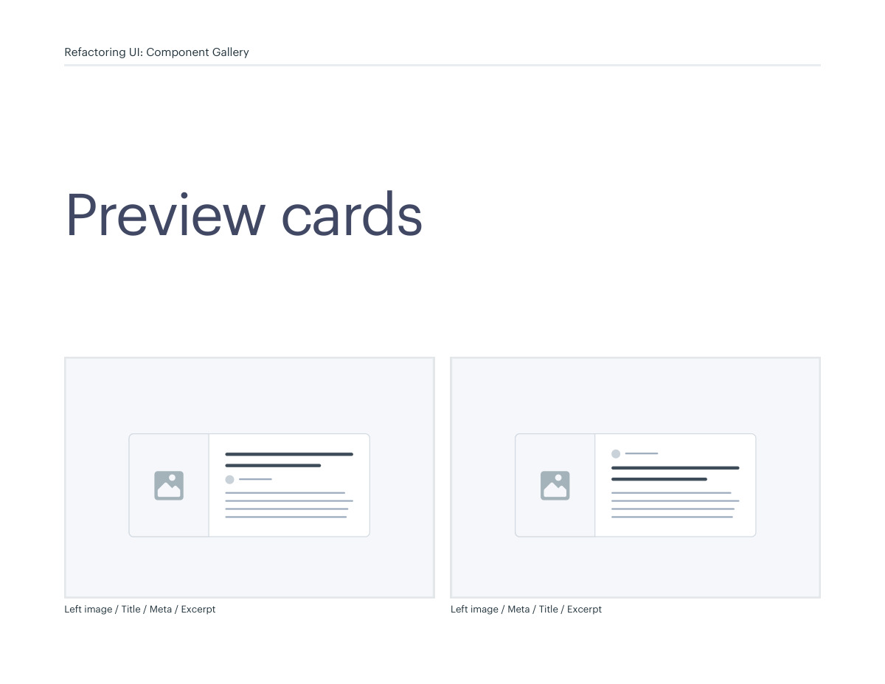
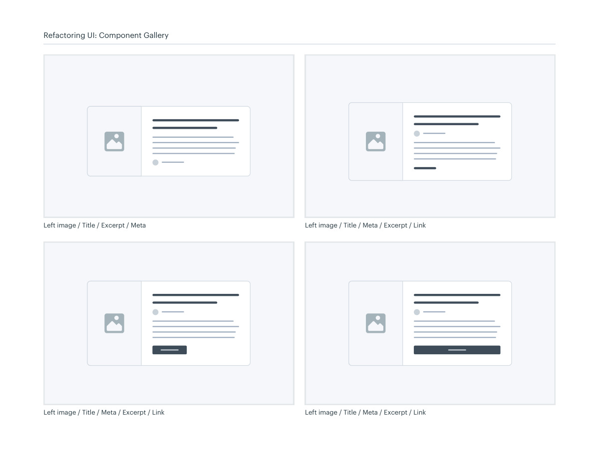
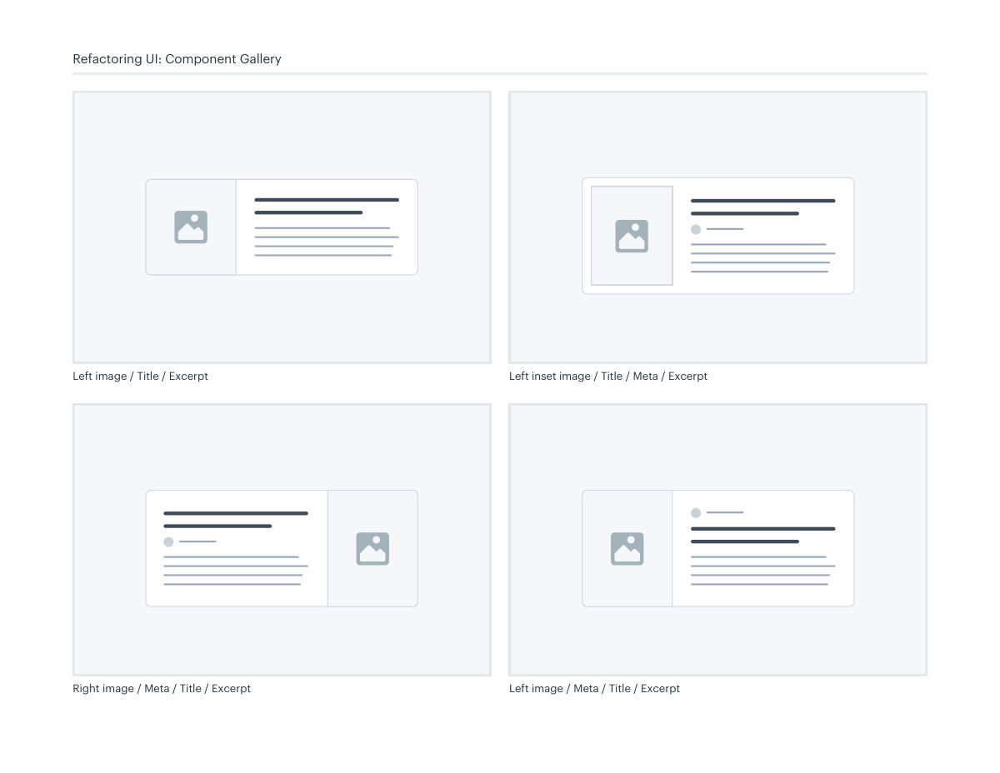
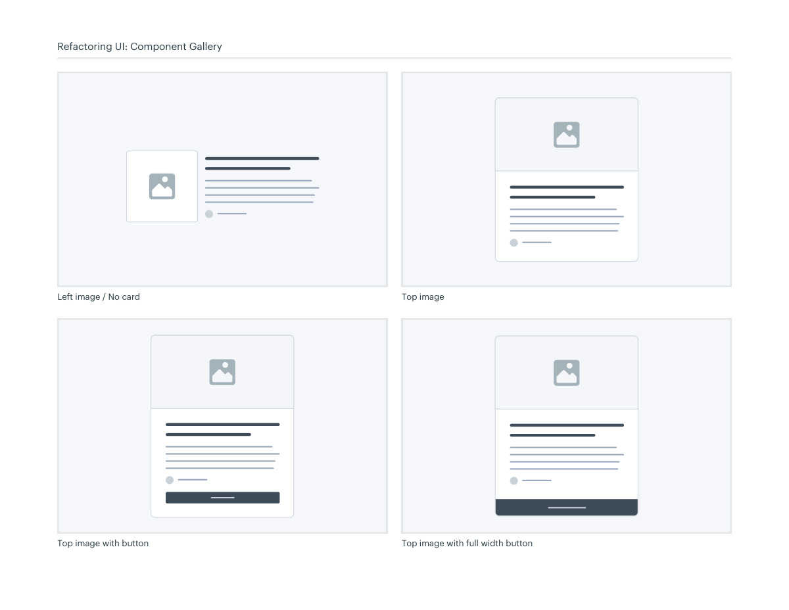
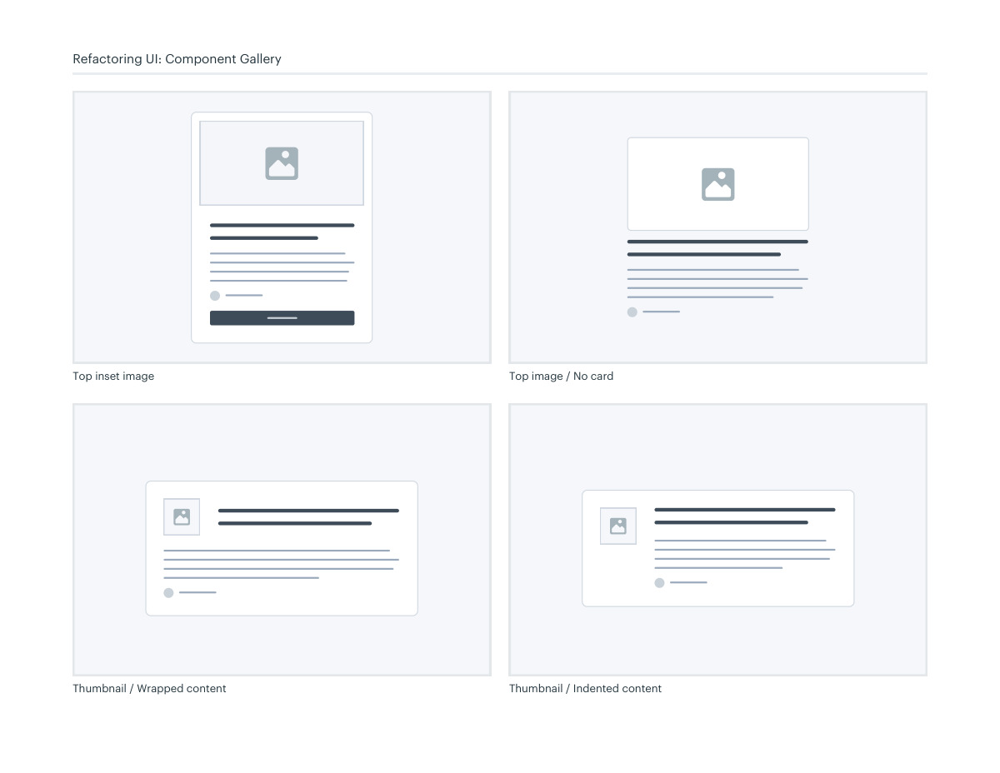

# Preview card layouts

## Apply this

- If content cards are hard to scan, choose a consistent order for title, image, metadata, and excerpt.
- Compare side, top, inset, and unboxed image treatments with the same real content.
- Check missing images and long titles; avoid nested ambiguous click targets.

## Source

Source: `Component Gallery v1.1.0.pdf`, version 1.1.0, PDF pages 64–69.
Apply this is new guidance; the source blocks below preserve the supplied pypdf extraction verbatim.
Page images preserve the original visual content, including text absent from extraction.

## Source pages

### Source page 64



```text
Preview cards
Left image / Title / Meta / Excerpt
Refactoring UI: Component Gallery
Left image / Meta / Title / Excerpt

```

### Source page 65



```text
Left image / Title / Excerpt / Meta
Refactoring UI: Component Gallery
Left image / Title / Meta / Excerpt / Link
Left image / Title / Meta / Excerpt / Link
 Left image / Title / Meta / Excerpt / Link

```

### Source page 66



```text
Left inset image / Title / Meta / Excerpt
Refactoring UI: Component Gallery
Right image / Meta / Title / Excerpt
Left image / Title / Excerpt
Left image / Meta / Title / Excerpt

```

### Source page 67



```text
Refactoring UI: Component Gallery
Left image / No card
 Top image
Top image with button
 Top image with full width button

```

### Source page 68



```text
Refactoring UI: Component Gallery
Top inset image
 Top image / No card
Thumbnail / Wrapped content
 Thumbnail / Indented content

```

### Source page 69


```text

```
