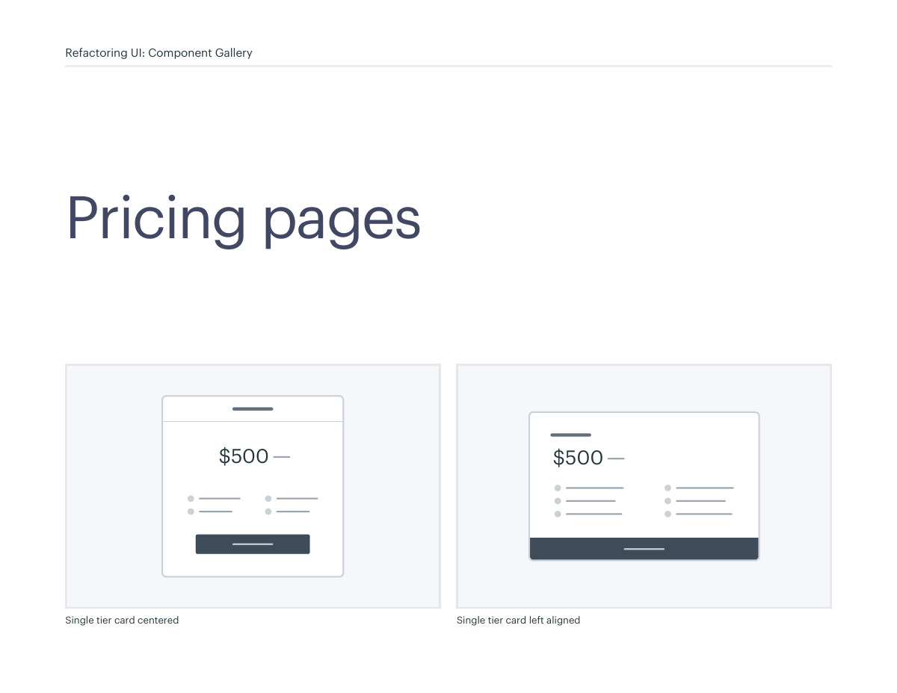
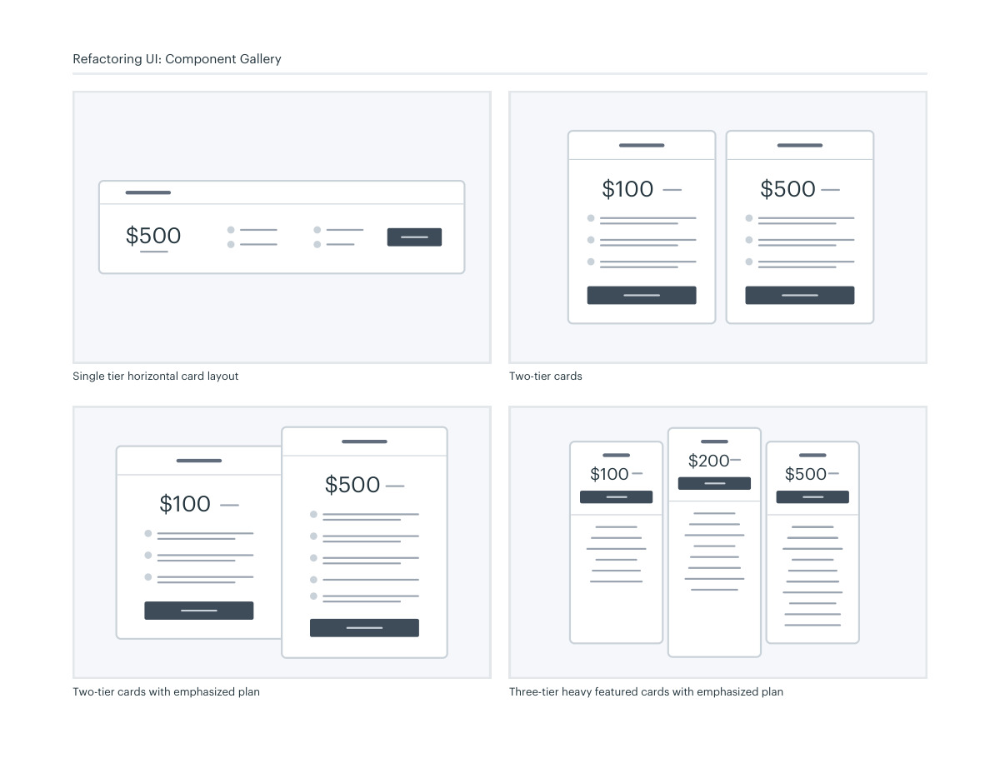
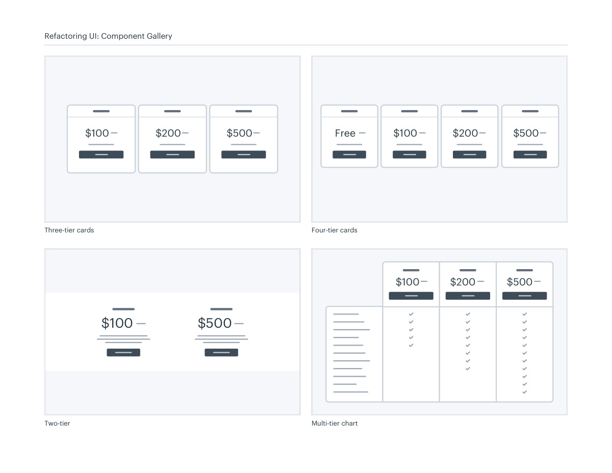
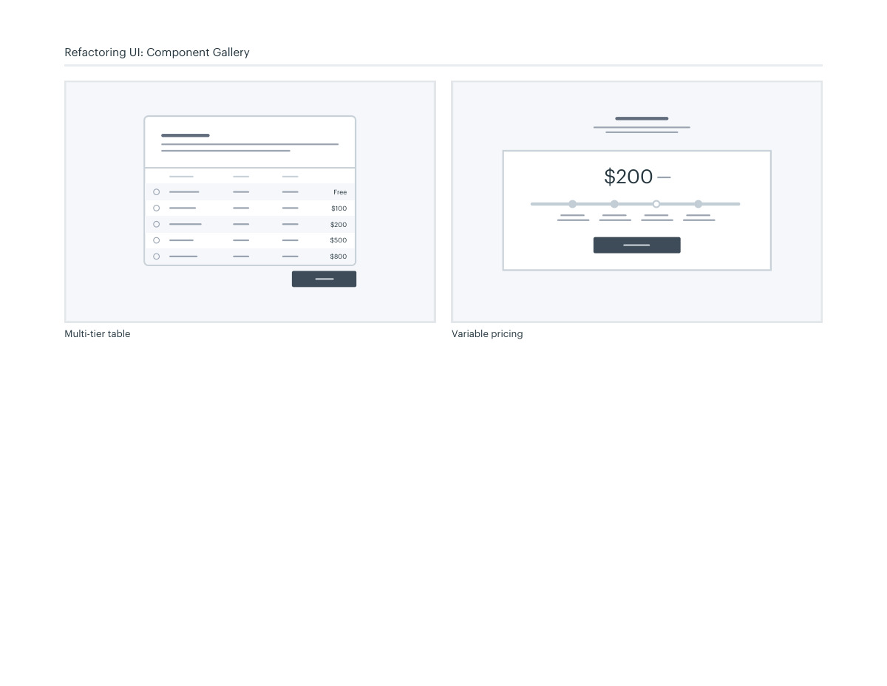

# Pricing comparison layouts

## Apply this

- If plans are difficult to compare, organize shared features and the key differences first.
- Choose cards, a table, or variable pricing around the number and complexity of plans.
- Test labels, billing periods, and emphasis; a featured plan must not obscure price or limitations.

## Source

Source: `Component Gallery v1.1.0.pdf`, version 1.1.0, PDF pages 44–47.
Apply this is new guidance; the source blocks below preserve the supplied pypdf extraction verbatim.
Page images preserve the original visual content, including text absent from extraction.

## Source pages

### Source page 44



```text
Single tier card centered
$500
Single tier card left aligned 
$500
Pricing pages
Refactoring UI: Component Gallery
```

### Source page 45



```text
Two-tier cards
$100 $500
Three-tier heavy featured cards with emphasized plan
$100 $500
$200
Two-tier cards with emphasized plan
$100
$500
Single tier horizontal card layout
$500
Refactoring UI: Component Gallery
```

### Source page 46



```text
Multi-tier chart
$100 $200 $500
Three-tier cards
$100 $200 $500
Four-tier cards
Free $100 $200 $500
$100 $500
Two-tier
Refactoring UI: Component Gallery
```

### Source page 47



```text
Multi-tier table
Free
$100
$200
$500
$800
Variable pricing
$200
Refactoring UI: Component Gallery
```
