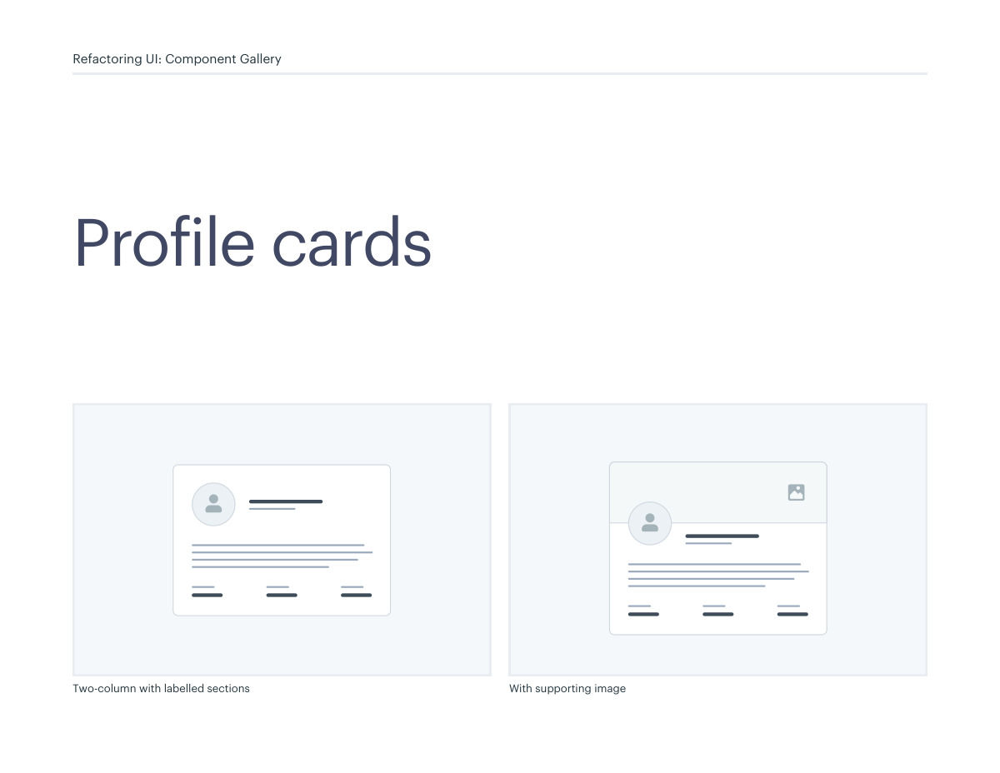
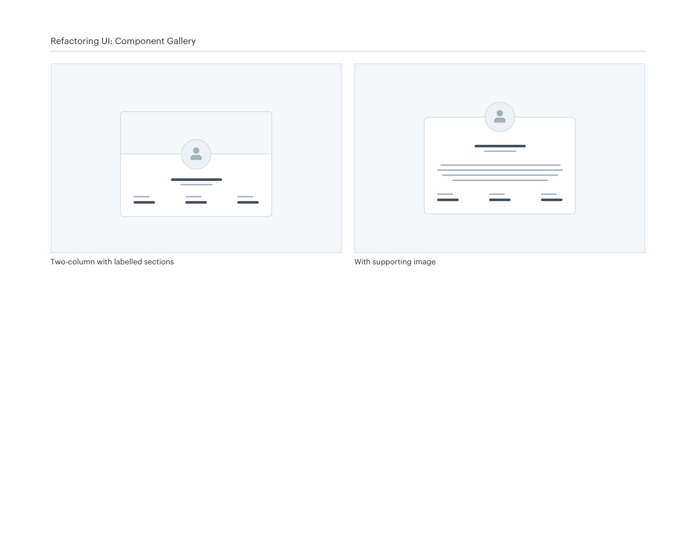

# Profile card layouts

## Apply this

- If profile information is difficult to compare, group identity separately from supporting details.
- Use labeled sections or supporting imagery where they clarify the information.
- Test absent fields and long values; preserve a clear reading order on small screens.

## Source

Source: `Component Gallery v1.1.0.pdf`, version 1.1.0, PDF pages 70–71.
Apply this is new guidance; the source blocks below preserve the supplied pypdf extraction verbatim.
Page images preserve the original visual content, including text absent from extraction.

## Source pages

### Source page 70



```text
Profile cards
Two-column with labelled sections With supporting image
Refactoring UI: Component Gallery
```

### Source page 71



```text
Two-column with labelled sections With supporting image
Refactoring UI: Component Gallery
```
