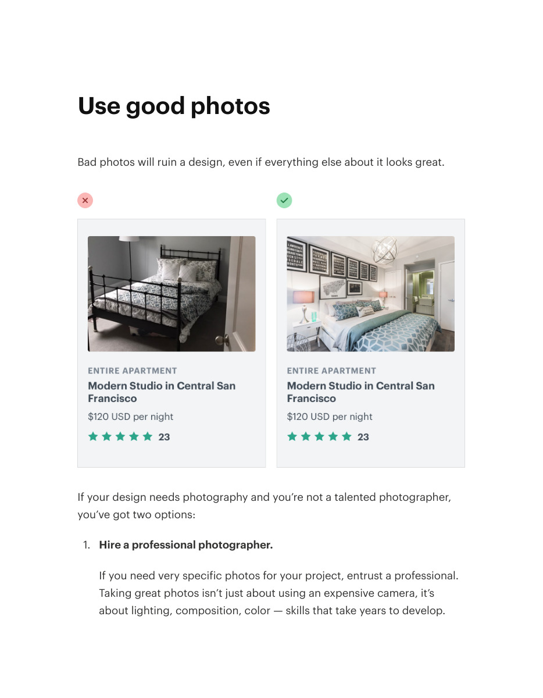
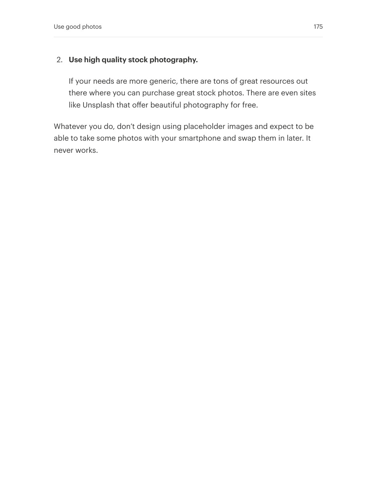

# Choose photos that support the interface

## Apply this

- If imagery weakens an otherwise polished layout, replace poor source photography first.
- Choose relevant, well-composed photographs rather than trying to rescue every image with effects.
- Check licenses, crops, and actual display size before treating a photo as a reusable asset.

## Source

Source: `Refactoring UI v1.0.2.pdf`, version 1.0.2, PDF pages 173–175.
Apply this is new guidance; the source blocks below preserve the supplied pypdf extraction verbatim.
Page images preserve the original visual content, including text absent from extraction.

### Source outline

- Working with Images (source page 173)
- Use good photos (source page 174)

## Source pages

### Source page 173


```text
Working with Images
```

### Source page 174



```text
Use good photos
Bad photos will ruin a design, even if everything else about it looks great.
If your design needs photography and you’re not a talented photographer,
you’ve got two options:
1. Hire a professional photographer.
If you need very specific photos for your project, entrust a professional.
Taking great photos isn’t just about using an expensive camera, it’s
about lighting, composition, color — skills that take years to develop.
```

### Source page 175



```text
2. Use high quality stock photography.
If your needs are more generic, there are tons of great resources out
there where you can purchase great stock photos. There are even sites
like Unsplash that offer beautiful photography for free.
Whatever you do, don’t design using placeholder images and expect to be
able to take some photos with your smartphone and swap them in later. It
never works.
Use good photos 175
```
