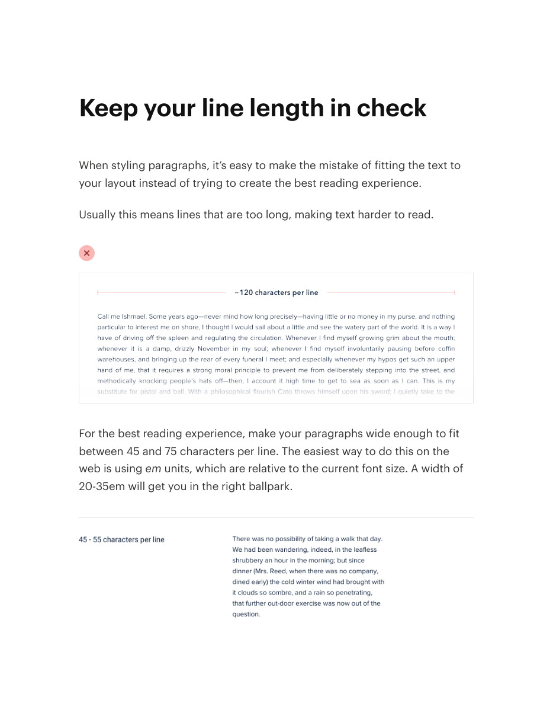
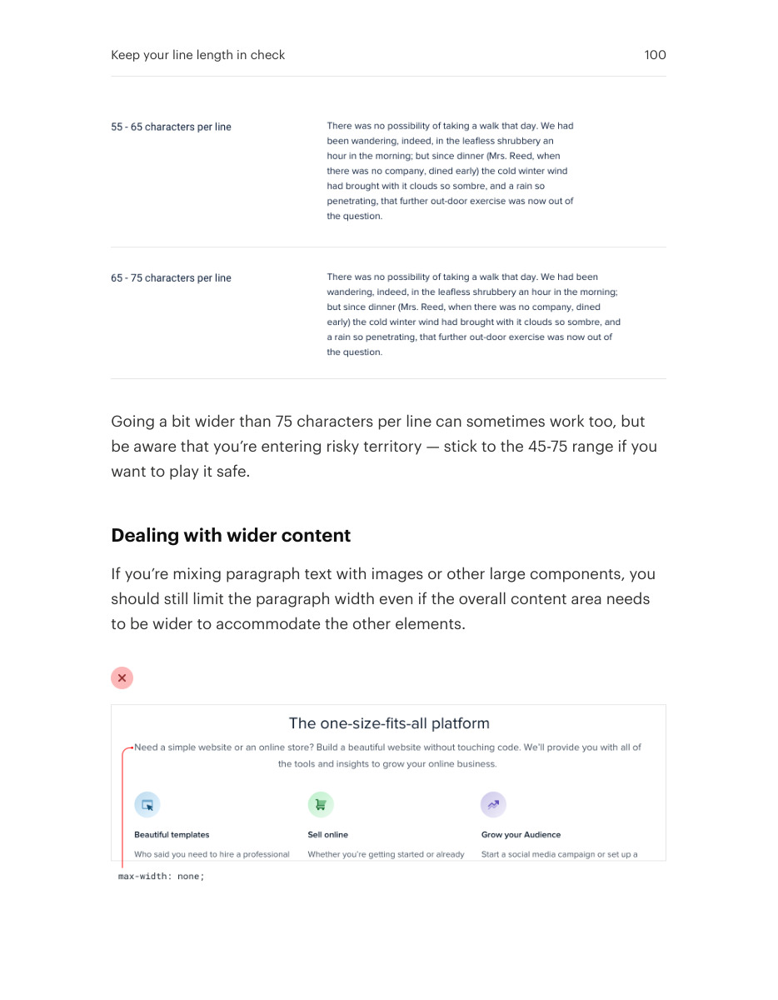

# Constrain text line length

## Apply this

- If paragraphs are tiring to scan, narrow the text column rather than enlarging the whole page.
- Aim for a comfortable reading measure and let wider supporting content extend independently.
- Check actual copy and responsive widths; very short labels do not need paragraph constraints.

## Source

Source: `Refactoring UI v1.0.2.pdf`, version 1.0.2, PDF pages 99–101.
Apply this is new guidance; the source blocks below preserve the supplied pypdf extraction verbatim.
Page images preserve the original visual content, including text absent from extraction.

### Source outline

- Keep your line length in check (source page 99)
  - Dealing with wider content (source page 100)

## Source pages

### Source page 99



```text
Keep your line length in check
When styling paragraphs, it’s easy to make the mistake of fitting the text to
your layout instead of trying to create the best reading experience.
Usually this means lines that are too long, making text harder to read.
For the best reading experience, make your paragraphs wide enough to fit
between 45 and 75 characters per line. The easiest way to do this on the
web is usingem units, which are relative to the current font size. A width of
20-35em will get you in the right ballpark.

```

### Source page 100



```text
Going a bit wider than 75 characters per line can sometimes work too, but
be aware that you’re entering risky territory — stick to the 45-75 range if you
want to play it safe.
Dealing with wider content
If you’re mixing paragraph text with images or other large components, you
should still limit the paragraph width even if the overall content area needs
to be wider to accommodate the other elements.
Keep your line length in check 100
```

### Source page 101


```text
It might seem counterintuitive at first to use different widths in the same
content area, but the result almost always looks more polished.
Keep your line length in check 101
```
