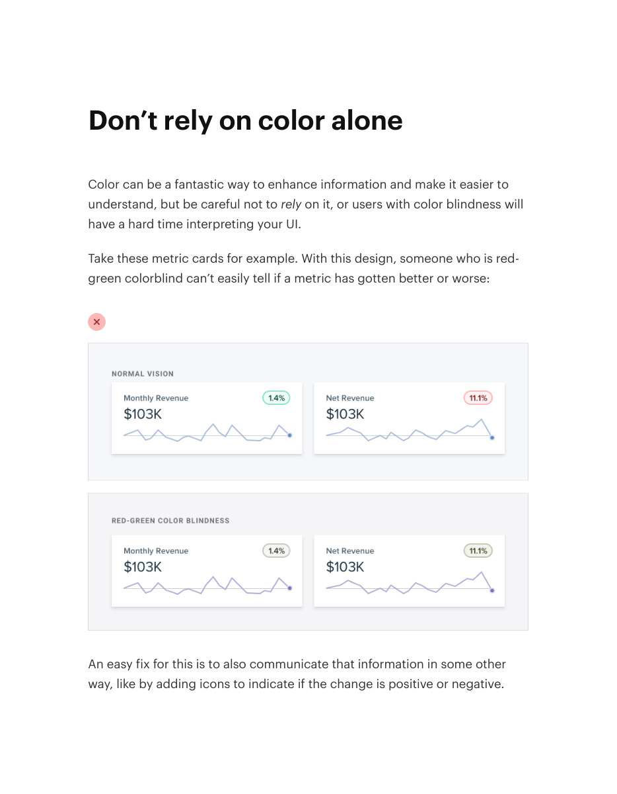
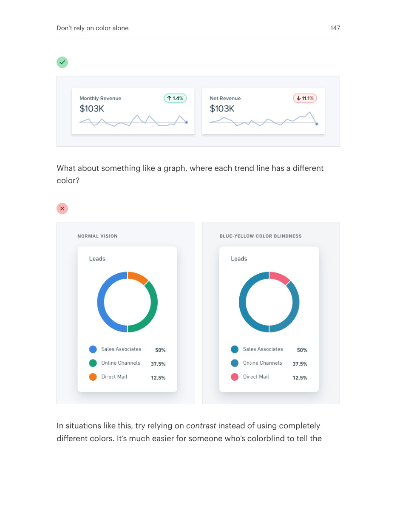
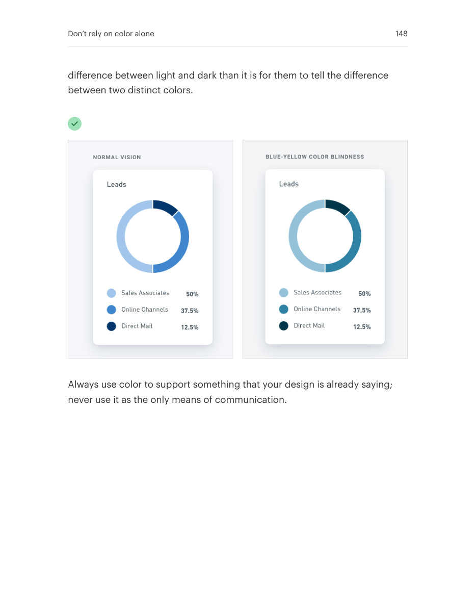

# Communicate meaning beyond color

## Apply this

- If status or categories are understandable only by hue, add a second cue.
- Pair color with text, icons, shapes, or patterns appropriate to the content.
- Verify the interface still communicates in grayscale and that the extra cue has an accessible name.

## Source

Source: `Refactoring UI v1.0.2.pdf`, version 1.0.2, PDF pages 146–148.
Apply this is new guidance; the source blocks below preserve the supplied pypdf extraction verbatim.
Page images preserve the original visual content, including text absent from extraction.

### Source outline

- Don’t rely on color alone (source page 146)

## Source pages

### Source page 146



```text
Don’t rely on color alone
Color can be a fantastic way to enhance information and make it easier to
understand, but be careful not torely on it, or users with color blindness will
have a hard time interpreting your UI.
Take these metric cards for example. With this design, someone who is red-
green colorblind can’t easily tell if a metric has gotten better or worse:
An easy fix for this is to also communicate that information in some other
way, like by adding icons to indicate if the change is positive or negative.
```

### Source page 147



```text
What about something like a graph, where each trend line has a different
color?
In situations like this, try relying oncontrast instead of using completely
different colors. It’s much easier for someone who’s colorblind to tell the
Don’t rely on color alone 147
```

### Source page 148



```text
difference between light and dark than it is for them to tell the difference
between two distinct colors.
Always use color to support something that your design is already saying;
never use it as the only means of communication.
Don’t rely on color alone 148
```
