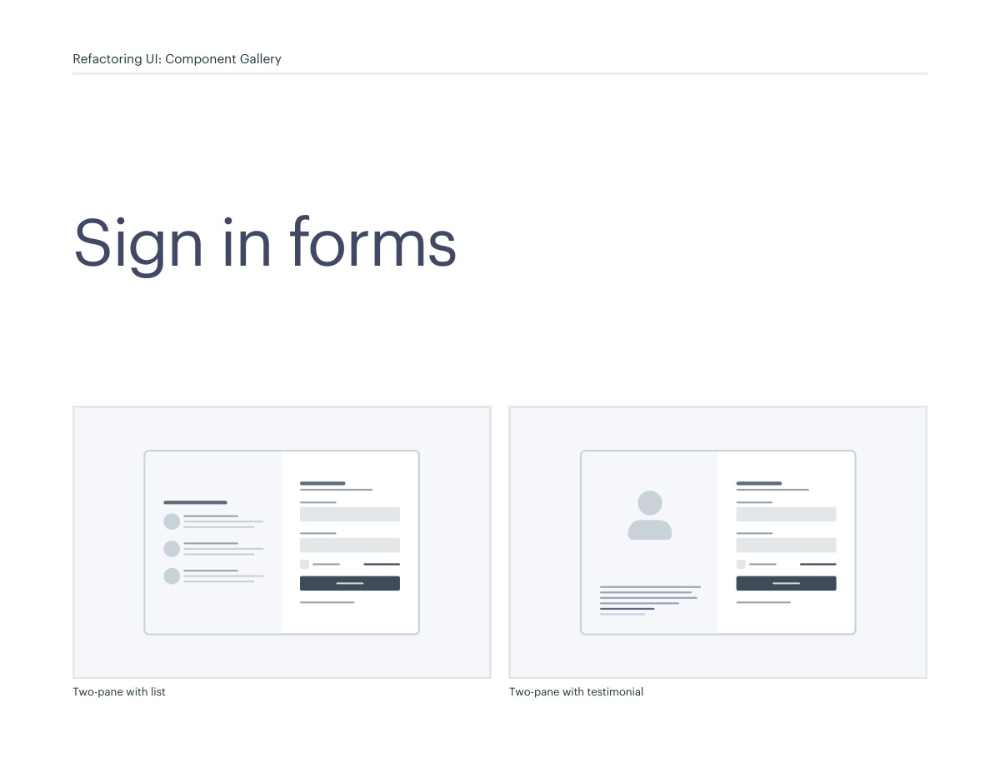
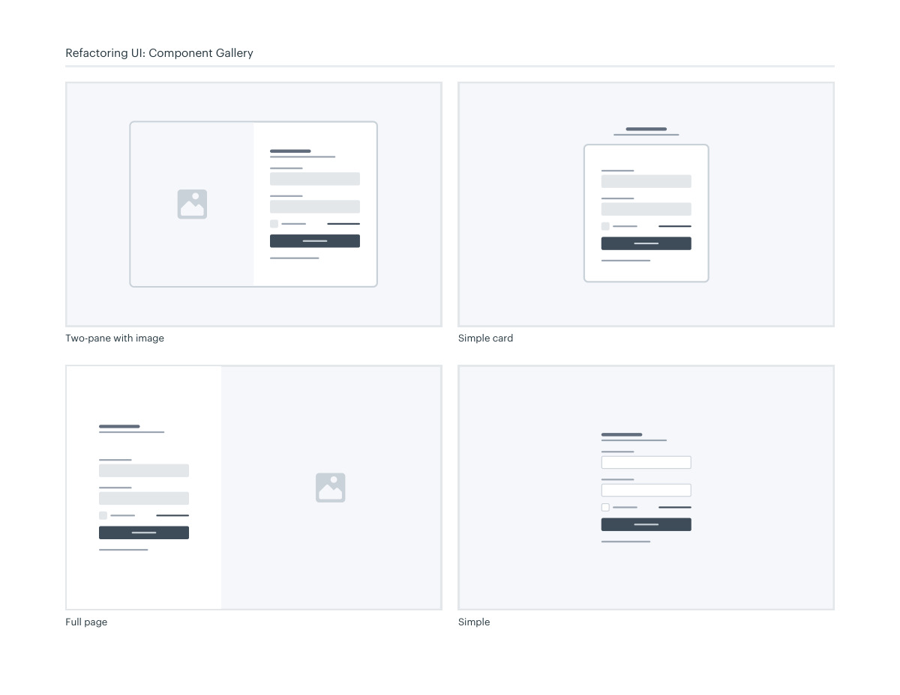

# Sign-in form layouts

## Apply this

- If a sign-in screen distracts from entry, keep credentials and the main action prominent.
- Compare a simple form, card, full-page, or split-panel layout for the available content.
- Test autofill, password managers, errors, and narrow screens before adding supporting imagery.

## Source

Source: `Component Gallery v1.1.0.pdf`, version 1.1.0, PDF pages 40–41.
Apply this is new guidance; the source blocks below preserve the supplied pypdf extraction verbatim.
Page images preserve the original visual content, including text absent from extraction.

## Source pages

### Source page 40



```text
Two-pane with list Two-pane with testimonial
Sign in forms
Refactoring UI: Component Gallery
```

### Source page 41



```text
Full page
Two-pane with image
Simple
Simple card
Refactoring UI: Component Gallery
```
