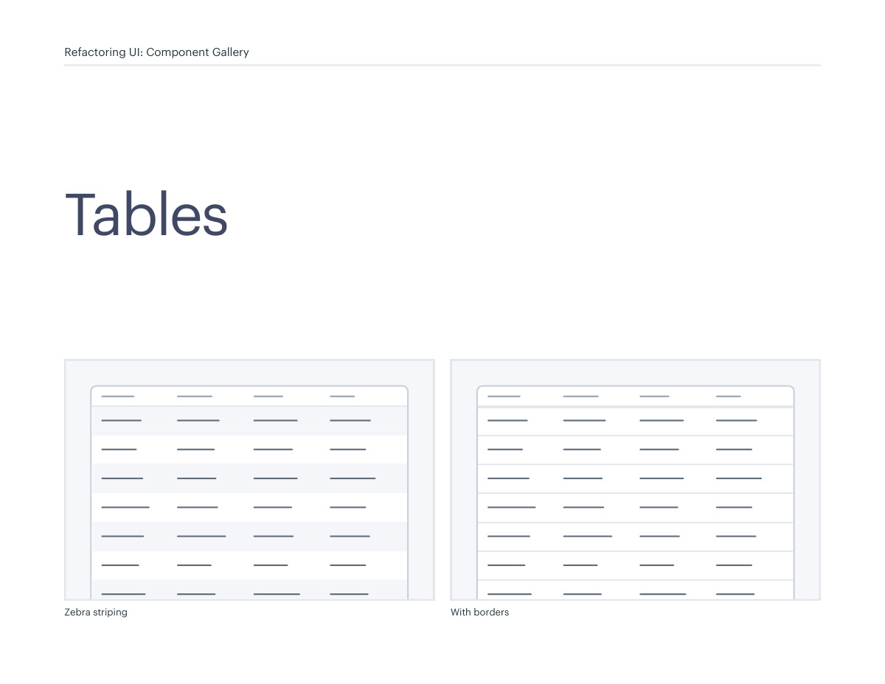
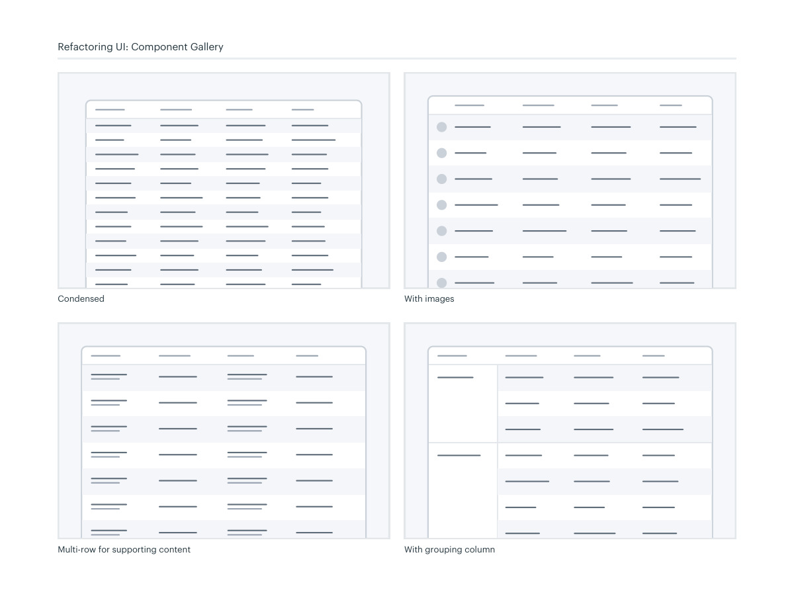
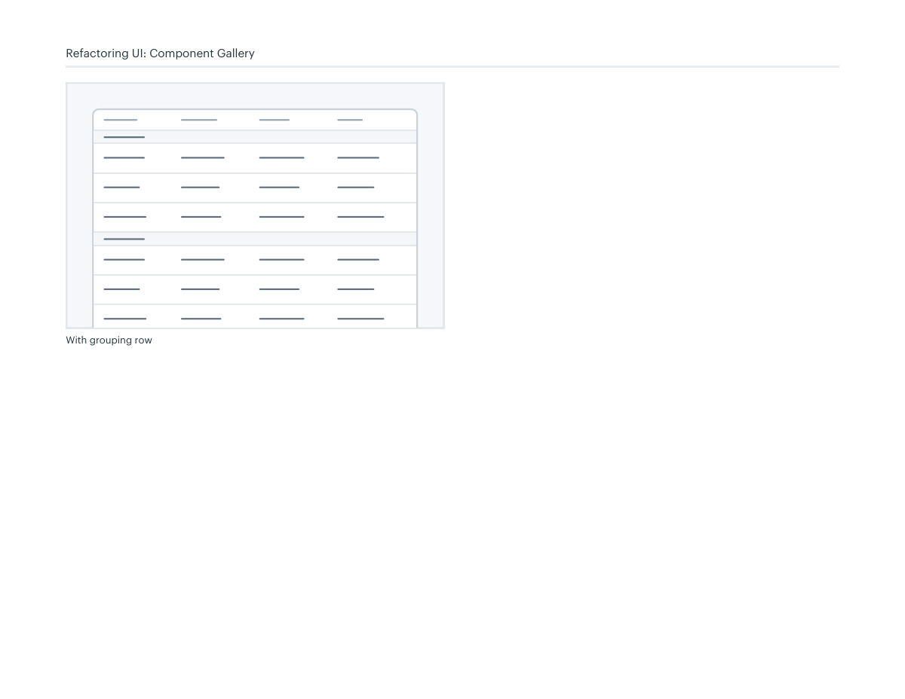

# Table density and grouping

## Apply this

- If tabular data is hard to compare, choose density and grouping around the comparison task.
- Compare whitespace, subtle striping, multi-row cells, and grouped rows or columns.
- Check numeric alignment, headings, and overflow; visual row styling does not replace table semantics.

## Source

Source: `Component Gallery v1.1.0.pdf`, version 1.1.0, PDF pages 36–39.
Apply this is new guidance; the source blocks below preserve the supplied pypdf extraction verbatim.
Page images preserve the original visual content, including text absent from extraction.

## Source pages

### Source page 36



```text
Tables
Refactoring UI: Component Gallery
Zebra striping
 With borders

```

### Source page 37



```text
Refactoring UI: Component Gallery
Condensed
 With images
Multi-row for supporting content
 With grouping column

```

### Source page 38



```text
Refactoring UI: Component Gallery
With grouping row

```

### Source page 39


```text

```
