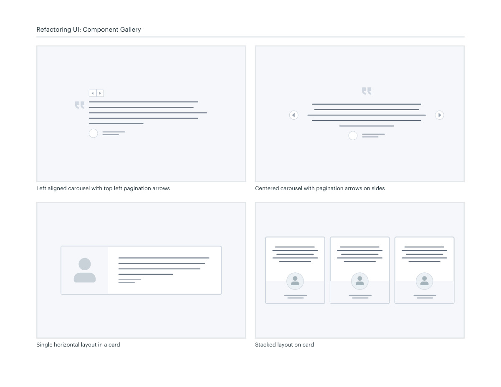

# Testimonial composition

## Apply this

- If social proof looks anonymous or hard to read, foreground the quotation and attribution.
- Compare a single card, stacked quotes, or a restrained carousel.
- Keep testimonials truthful and controls accessible; provide enough reading time and avoid forced motion.

## Source

Source: `Component Gallery v1.1.0.pdf`, version 1.1.0, PDF pages 84–85.
Apply this is new guidance; the source blocks below preserve the supplied pypdf extraction verbatim.
Page images preserve the original visual content, including text absent from extraction.

## Source pages

### Source page 84


```text
Testimonial sections
Left aligned carousel with dotted pagination
Refactoring UI: Component Gallery
Centered carousel with dotted pagination

```

### Source page 85



```text
Single horizontal layout in a card Stacked layout on card
Refactoring UI: Component Gallery
Left aligned carousel with top left pagination arrows
 Centered carousel with pagination arrows on sides

```
