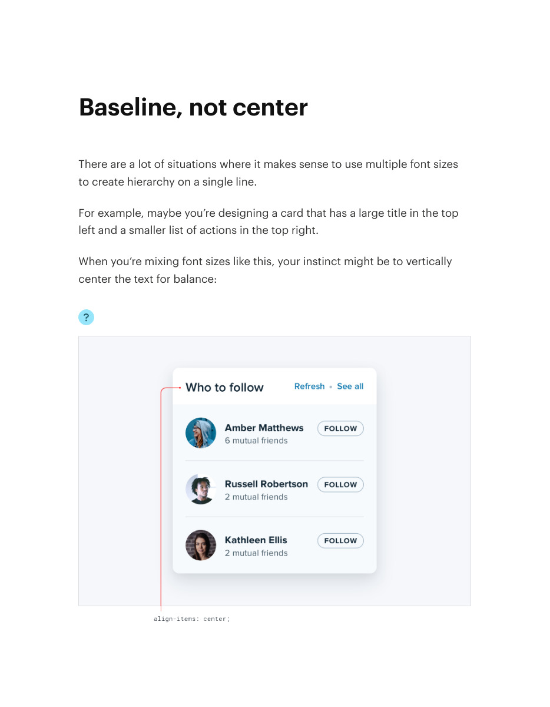
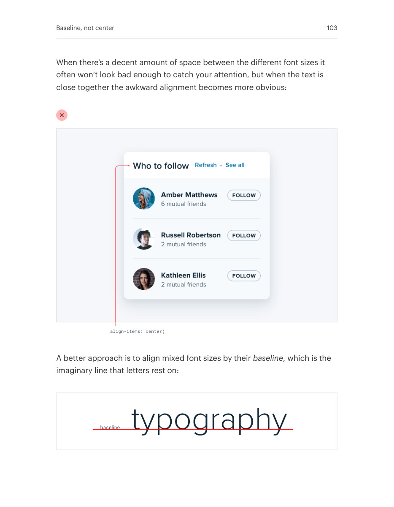
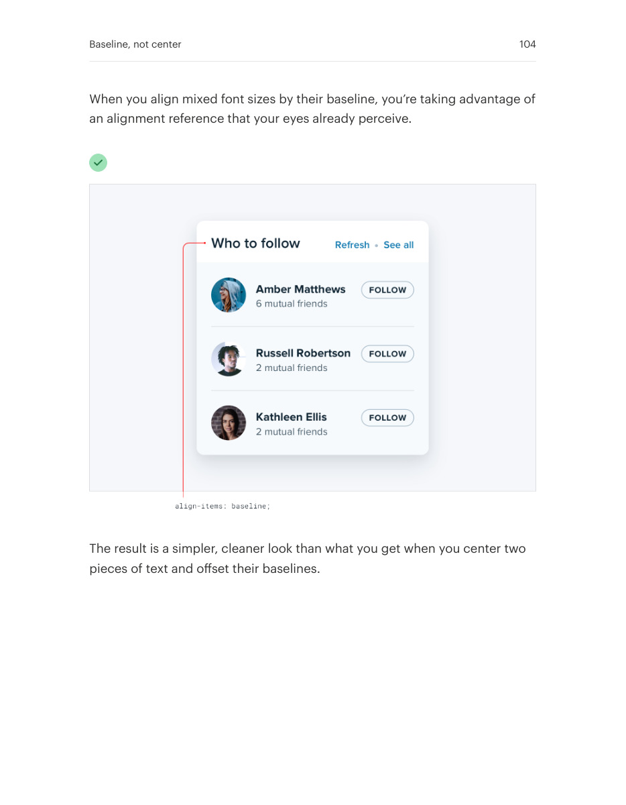

# Align mixed-size text on the baseline

## Apply this

- If adjacent text looks vertically misaligned, align its baselines rather than its boxes.
- Use baseline alignment for headings, metadata, and inline text of different sizes.
- Compare actual glyphs; use optical adjustments when icons or non-text shapes have no useful baseline.

## Source

Source: `Refactoring UI v1.0.2.pdf`, version 1.0.2, PDF pages 102–104.
Apply this is new guidance; the source blocks below preserve the supplied pypdf extraction verbatim.
Page images preserve the original visual content, including text absent from extraction.

### Source outline

- Baseline, not center (source page 102)

## Source pages

### Source page 102



```text
Baseline, not center
There are a lot of situations where it makes sense to use multiple font sizes
to create hierarchy on a single line.
For example, maybe you’re designing a card that has a large title in the top
left and a smaller list of actions in the top right.
When you’re mixing font sizes like this, your instinct might be to vertically
center the text for balance:

```

### Source page 103



```text
When there’s a decent amount of space between the different font sizes it
often won’t look bad enough to catch your attention, but when the text is
close together the awkward alignment becomes more obvious:
A better approach is to align mixed font sizes by theirbaseline, which is the
imaginary line that letters rest on:
Baseline, not center 103
```

### Source page 104



```text
When you align mixed font sizes by their baseline, you’re taking advantage of
an alignment reference that your eyes already perceive.
The result is a simpler, cleaner look than what you get when you center two
pieces of text and offset their baselines.
Baseline, not center 104
```
