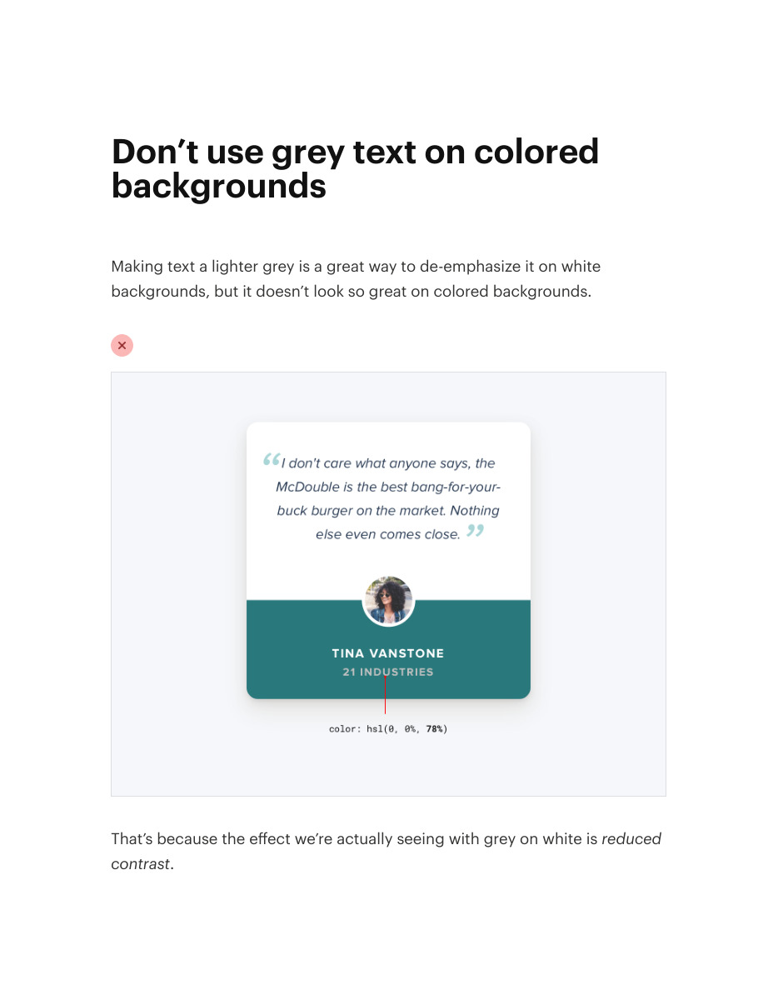
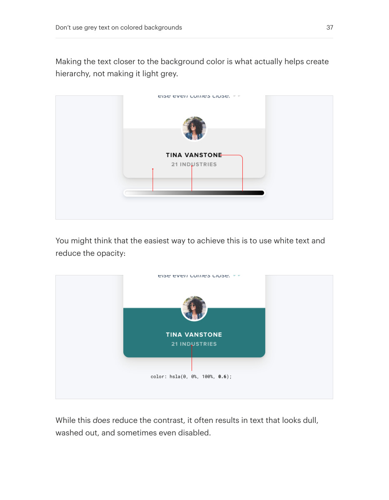
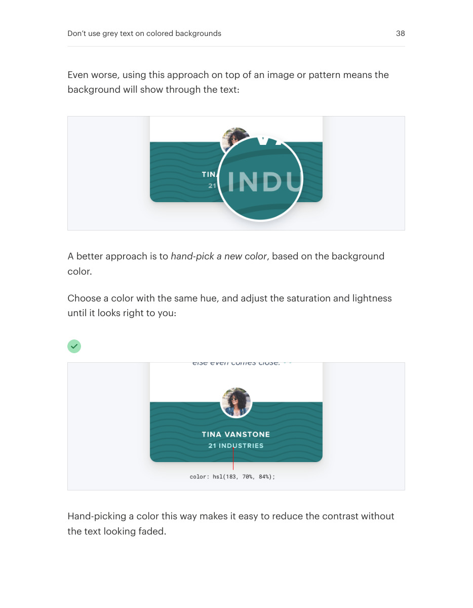

# Use readable text on colored surfaces

## Apply this

- If gray text looks dull on a colored panel, derive a lighter text tint from the panel hue.
- Choose a text color that matches the surface temperature while preserving contrast.
- Measure contrast in every state; do not assume a related hue is automatically accessible.

## Source

Source: `Refactoring UI v1.0.2.pdf`, version 1.0.2, PDF pages 36–38.
Apply this is new guidance; the source blocks below preserve the supplied pypdf extraction verbatim.
Page images preserve the original visual content, including text absent from extraction.

### Source outline

- Don’t use grey text on colored backgrounds (source page 36)

## Source pages

### Source page 36



```text
Don’t use grey text on colored
backgrounds
Making text a lighter grey is a great way to de-emphasize it on white
backgrounds, but it doesn’t look so great on colored backgrounds.
That’s because the effect we’re actually seeing with grey on white isreduced
contrast.
```

### Source page 37



```text
Making the text closer to the background color is what actually helps create
hierarchy, not making it light grey.
You might think that the easiest way to achieve this is to use white text and
reduce the opacity:
While thisdoes reduce the contrast, it often results in text that looks dull,
washed out, and sometimes even disabled.
Don’t use grey text on colored backgrounds 37
```

### Source page 38



```text
Even worse, using this approach on top of an image or pattern means the
background will show through the text:
A better approach is tohand-pick a new color, based on the background
color.
Choose a color with the same hue, and adjust the saturation and lightness
until it looks right to you:
Hand-picking a color this way makes it easy to reduce the contrast without
the text looking faded.
Don’t use grey text on colored backgrounds 38
```
