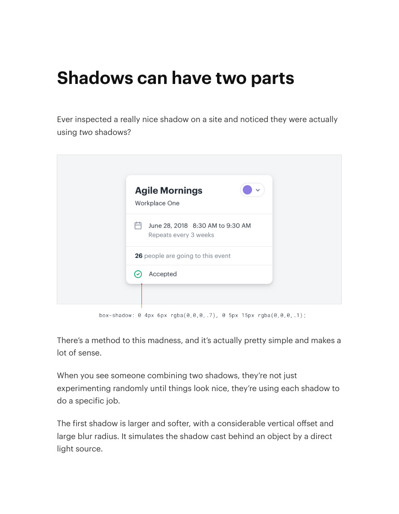
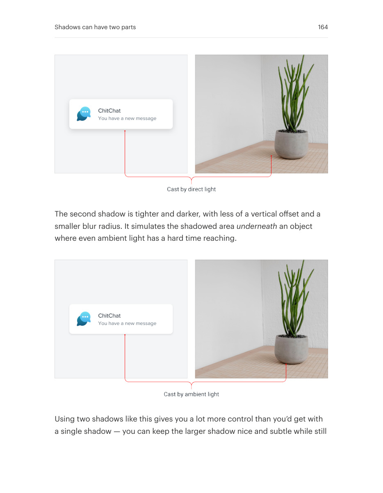
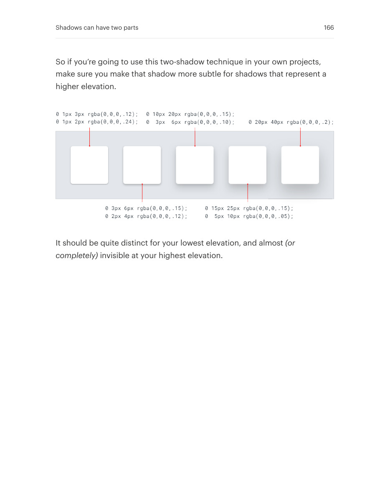

# Combine shadows for credible depth

## Apply this

- If a single blur looks muddy, separate ambient depth from a tighter contact shadow.
- Tune the two parts together and reduce contact shadow as the surface rises.
- Inspect against the real background; extra shadow layers should clarify depth, not create a halo.

## Source

Source: `Refactoring UI v1.0.2.pdf`, version 1.0.2, PDF pages 163–166.
Apply this is new guidance; the source blocks below preserve the supplied pypdf extraction verbatim.
Page images preserve the original visual content, including text absent from extraction.

### Source outline

- Shadows can have two parts (source page 163)
  - Accounting for elevation (source page 165)

## Source pages

### Source page 163



```text
Shadows can have two parts
Ever inspected a really nice shadow on a site and noticed they were actually
usingtwo shadows?
There’s a method to this madness, and it’s actually pretty simple and makes a
lot of sense.
When you see someone combining two shadows, they’re not just
experimenting randomly until things look nice, they’re using each shadow to
do a specific job.
The first shadow is larger and softer, with a considerable vertical offset and
large blur radius. It simulates the shadow cast behind an object by a direct
light source.
```

### Source page 164



```text
The second shadow is tighter and darker, with less of a vertical offset and a
smaller blur radius. It simulates the shadowed areaunderneath an object
where even ambient light has a hard time reaching.
Using two shadows like this gives you a lot more control than you’d get with
a single shadow — you can keep the larger shadow nice and subtle while still
Shadows can have two parts 164
```

### Source page 165


```text
making the shadow closer the element’s edges nice and defined.
Accounting for elevation
As an object gets further away from a surface, the small, dark shadow
created by a lack of ambient light slowly disappears(go ahead, try it out with
something on your desk).
Shadows can have two parts 165
```

### Source page 166



```text
So if you’re going to use this two-shadow technique in your own projects,
make sure you make that shadow more subtle for shadows that represent a
higher elevation.
It should be quite distinct for your lowest elevation, and almost(or
completely) invisible at your highest elevation.
Shadows can have two parts 166
```
