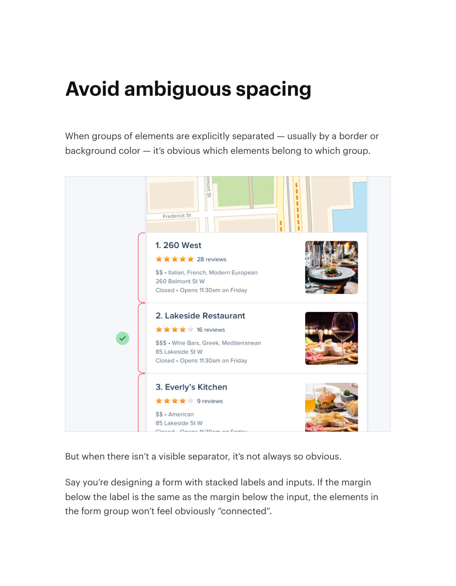
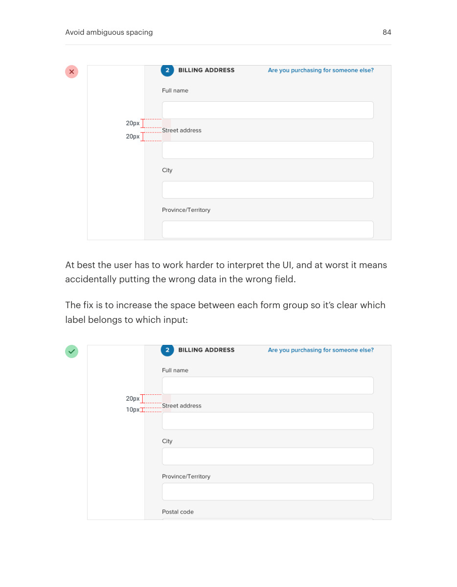
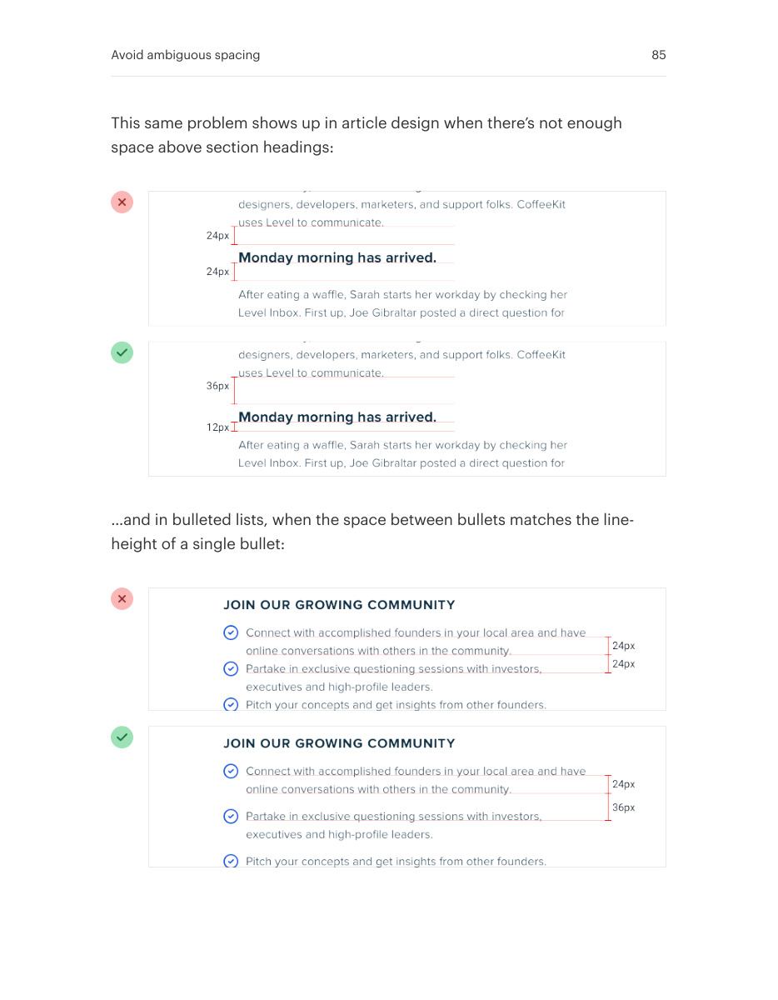
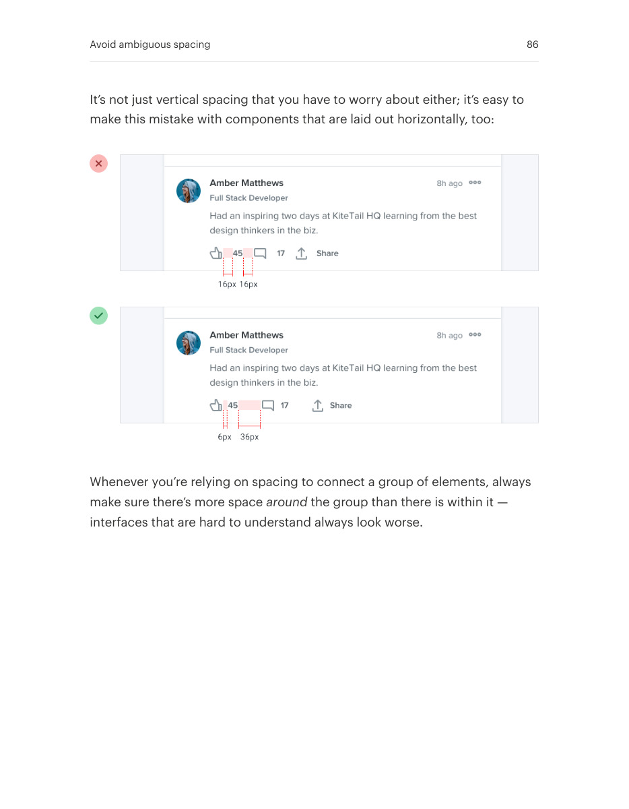

# Use spacing to clarify groups

## Apply this

- If readers cannot tell which label belongs to which control, inspect competing gaps.
- Make within-group spacing clearly smaller than between-group spacing.
- Check repeated groups and narrow layouts; add structure only when spacing alone cannot disambiguate them.

## Source

Source: `Refactoring UI v1.0.2.pdf`, version 1.0.2, PDF pages 83–86.
Apply this is new guidance; the source blocks below preserve the supplied pypdf extraction verbatim.
Page images preserve the original visual content, including text absent from extraction.

### Source outline

- Avoid ambiguous spacing (source page 83)

## Source pages

### Source page 83



```text
Avoid ambiguous spacing
When groups of elements are explicitly separated — usually by a border or
background color — it’s obvious which elements belong to which group.
But when there isn’t a visible separator, it’s not always so obvious.
Say you’re designing a form with stacked labels and inputs. If the margin
below the label is the same as the margin below the input, the elements in
the form group won’t feel obviously “connected”.
```

### Source page 84



```text
At best the user has to work harder to interpret the UI, and at worst it means
accidentally putting the wrong data in the wrong field.
The fix is to increase the space between each form group so it’s clear which
label belongs to which input:
Avoid ambiguous spacing 84
```

### Source page 85



```text
This same problem shows up in article design when there’s not enough
space above section headings:
…and in bulleted lists, when the space between bullets matches the line-
height of a single bullet:
Avoid ambiguous spacing 85
```

### Source page 86



```text
It’s not just vertical spacing that you have to worry about either; it’s easy to
make this mistake with components that are laid out horizontally, too:
Whenever you’re relying on spacing to connect a group of elements, always
make sure there’s more spacearound the group than there is within it —
interfaces that are hard to understand always look worse.
Avoid ambiguous spacing 86
```
