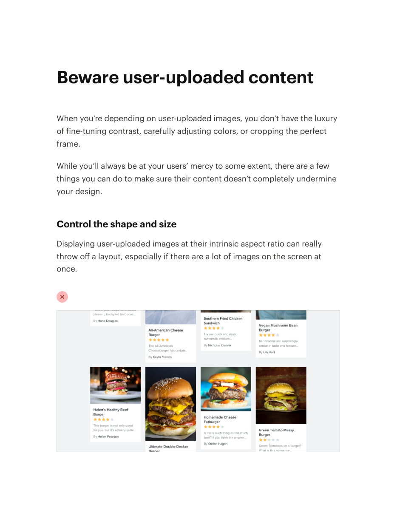
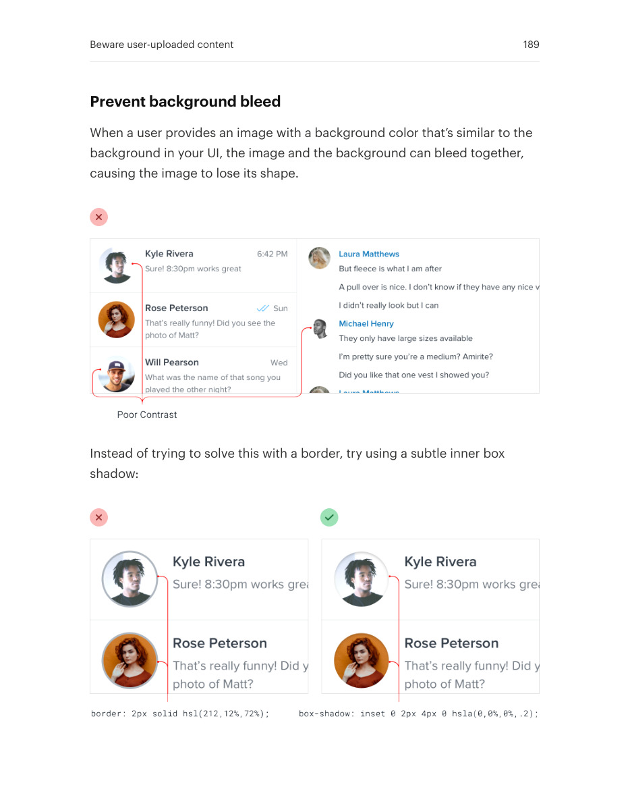
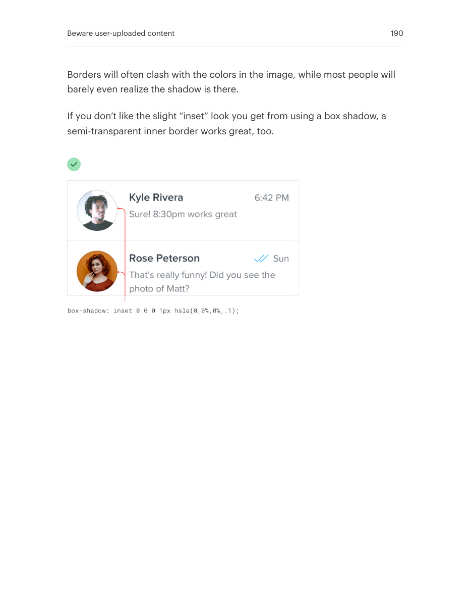

# Contain unpredictable uploaded images

## Apply this

- If uploaded images break a layout, define the display box independently of source dimensions.
- Crop within a fixed shape and add a subtle boundary or inset treatment when backgrounds bleed together.
- Test portrait, landscape, transparent, very light, and very dark uploads without distorting them.

## Source

Source: `Refactoring UI v1.0.2.pdf`, version 1.0.2, PDF pages 187–190.
Apply this is new guidance; the source blocks below preserve the supplied pypdf extraction verbatim.
Page images preserve the original visual content, including text absent from extraction.

### Source outline

- Beware user-uploaded content (source page 187)
  - Control the shape and size (source page 187)
  - Prevent background bleed (source page 189)

## Source pages

### Source page 187



```text
Beware user-uploaded content
When you’re depending on user-uploaded images, you don’t have the luxury
of fine-tuning contrast, carefully adjusting colors, or cropping the perfect
frame.
While you’ll always be at your users’ mercy to some extent, thereare a few
things you can do to make sure their content doesn’t completely undermine
your design.
Control the shape and size
Displaying user-uploaded images at their intrinsic aspect ratio can really
throw off a layout, especially if there are a lot of images on the screen at
once.

```

### Source page 188


```text
Instead of letting users wreak havoc on your page structure, center their
images inside fixed containers, cropping out anything that doesn’t fit.
This is really easy to do with CSS these days by making the image a
background image, and setting thebackground-size property tocover.
Beware user-uploaded content 188
```

### Source page 189



```text
Prevent background bleed
When a user provides an image with a background color that’s similar to the
background in your UI, the image and the background can bleed together,
causing the image to lose its shape.
Instead of trying to solve this with a border, try using a subtle inner box
shadow:
Beware user-uploaded content 189
```

### Source page 190



```text
Borders will often clash with the colors in the image, while most people will
barely even realize the shadow is there.
If you don’t like the slight “inset” look you get from using a box shadow, a
semi-transparent inner border works great, too.
Beware user-uploaded content 190
```
