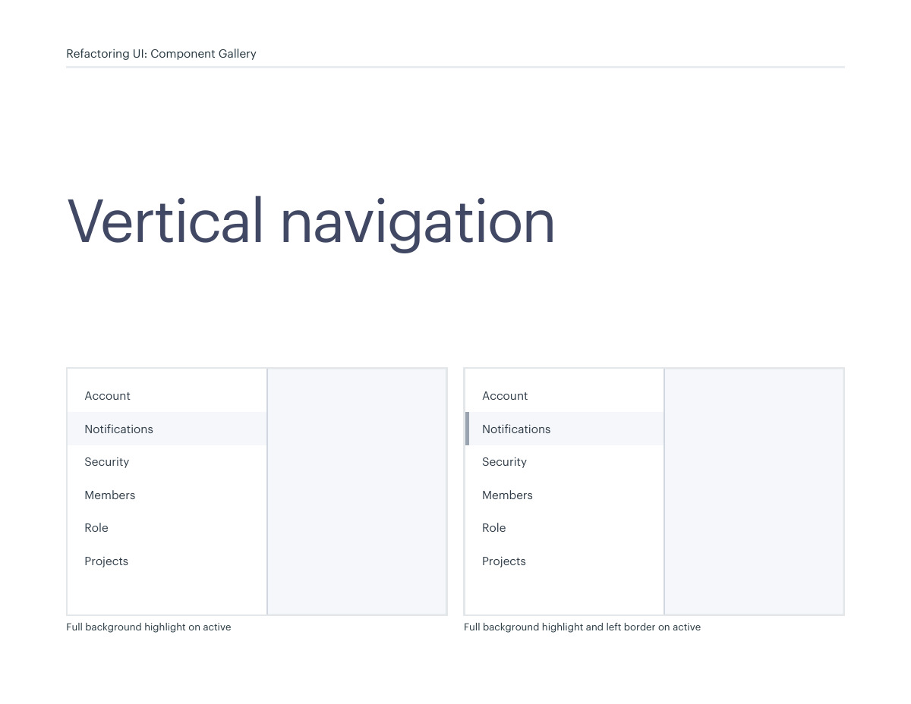
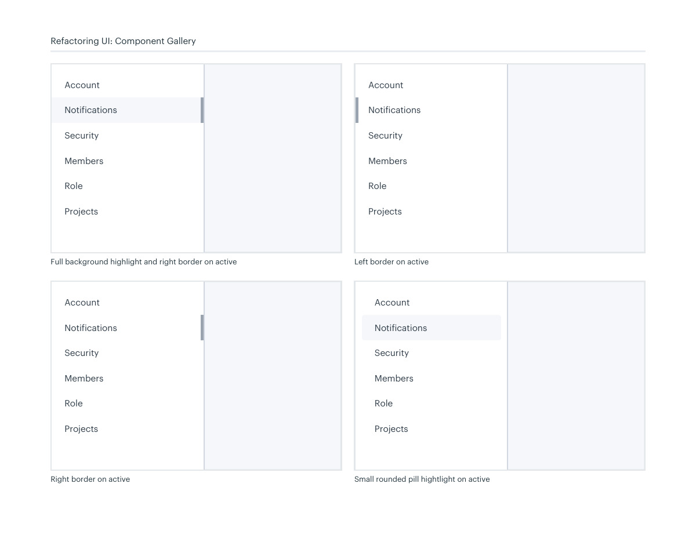
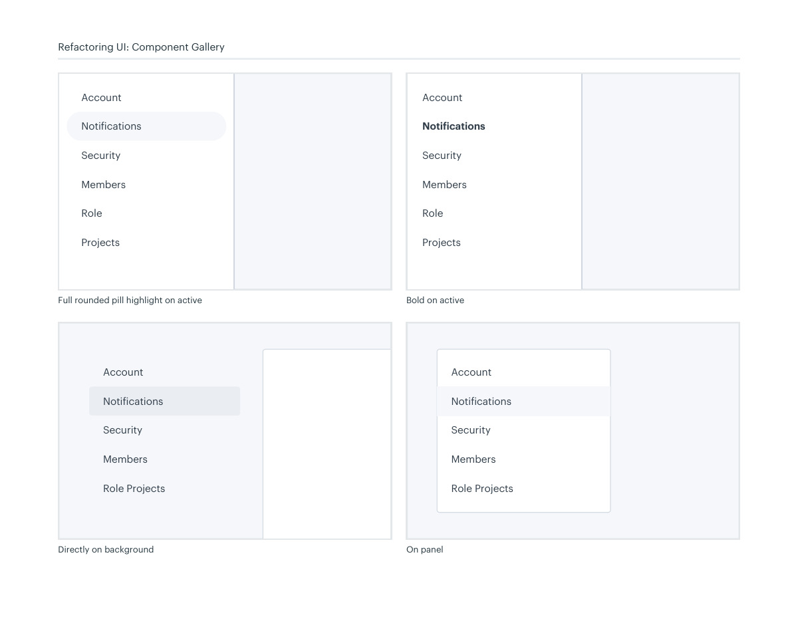
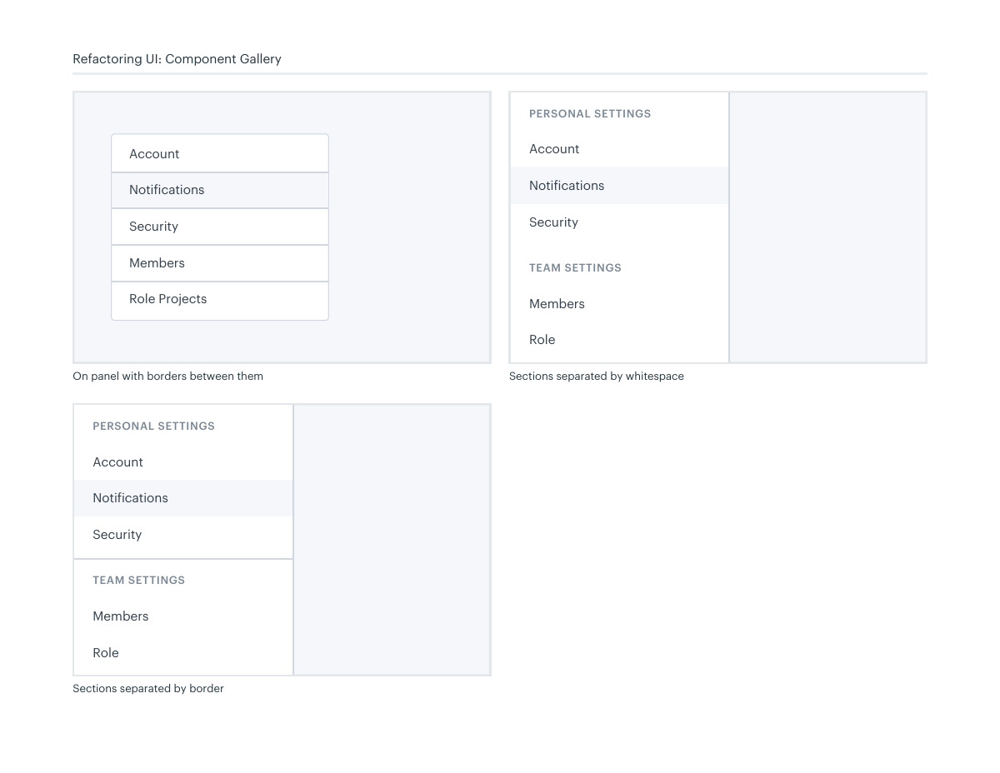

# Vertical navigation groups

## Apply this

- If a sidebar is difficult to scan, group related destinations before decorating rows.
- Compare quiet backgrounds, pill highlights, accent edges, and whitespace-separated sections.
- Test long names and selected/focus states; use icons as supplements rather than unexplained substitutes.

## Source

Source: `Component Gallery v1.1.0.pdf`, version 1.1.0, PDF pages 32–35.
Apply this is new guidance; the source blocks below preserve the supplied pypdf extraction verbatim.
Page images preserve the original visual content, including text absent from extraction.

## Source pages

### Source page 32



```text
Vertical navigation
Full background highlight on active
Refactoring UI: Component Gallery
Account
Notifications
Security
Members
Role 
Projects
Full background highlight and left border on active
Account
Notifications
Security
Members
Role 
Projects
```

### Source page 33



```text
Refactoring UI: Component Gallery
Full background highlight and right border on active
Account
Notifications
Security
Members
Role 
Projects
Right border on active
Account
Notifications
Security
Members
Role 
Projects
Left border on active
Account
Notifications
Security
Members
Role 
Projects
Small rounded pill hightlight on active
Account
Notifications
Security
Members
Role 
Projects
```

### Source page 34



```text
Directly on background
Account
Notifications
Security
Members
Role Projects
Refactoring UI: Component Gallery
Full rounded pill highlight on active
Account
Notifications
Security
Members
Role 
Projects
Bold on active
Account
Notifications
Security
Members
Role 
Projects
On panel
Account
Notifications
Security
Members
Role Projects
```

### Source page 35



```text
Refactoring UI: Component Gallery
Account
Notifications
Security
Members
Role Projects
On panel with borders between them Sections separated by whitespace
Account
Notifications
Security
PERSONAL SETTINGS
TEAM SETTINGS
Members
Role 
Sections separated by border
Account
Notifications
Security
PERSONAL SETTINGS
TEAM SETTINGS
Members
Role 
```
