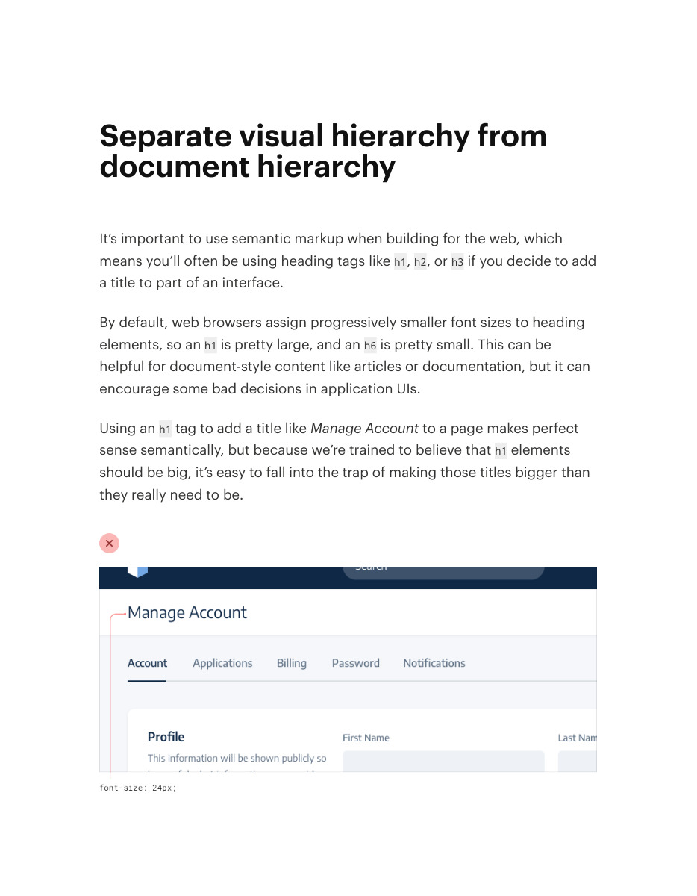
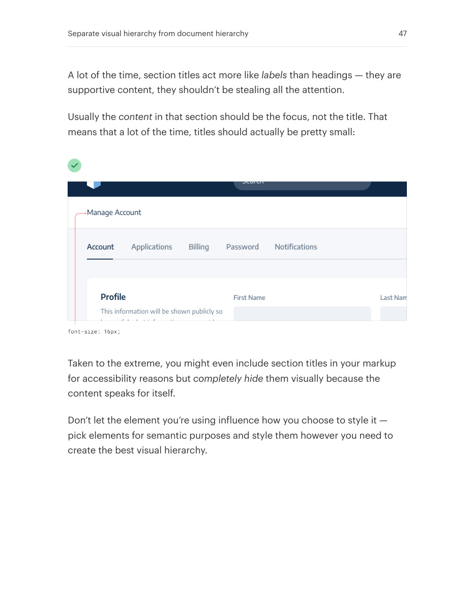

# Separate visual and document hierarchy

## Apply this

- If semantic headings dominate the screen unnecessarily, keep structure and styling independent.
- Use appropriate heading elements while giving them the visual emphasis their content deserves.
- Verify the document outline and screen-reader navigation still make sense after restyling.

## Source

Source: `Refactoring UI v1.0.2.pdf`, version 1.0.2, PDF pages 46–47.
Apply this is new guidance; the source blocks below preserve the supplied pypdf extraction verbatim.
Page images preserve the original visual content, including text absent from extraction.

### Source outline

- Separate visual hierarchy from document hierarchy (source page 46)

## Source pages

### Source page 46



```text
Separate visual hierarchy from
document hierarchy
It’s important to use semantic markup when building for the web, which
means you’ll often be using heading tags likeh1,h2, orh3 if you decide to add
a title to part of an interface.
By default, web browsers assign progressively smaller font sizes to heading
elements, so anh1 is pretty large, and anh6 is pretty small. This can be
helpful for document-style content like articles or documentation, but it can
encourage some bad decisions in application UIs.
Using anh1 tag to add a title likeManage Account to a page makes perfect
sense semantically, but because we’re trained to believe thath1 elements
should be big, it’s easy to fall into the trap of making those titles bigger than
they really need to be.

```

### Source page 47



```text
A lot of the time, section titles act more likelabels than headings — they are
supportive content, they shouldn’t be stealing all the attention.
Usually thecontent in that section should be the focus, not the title. That
means that a lot of the time, titles should actually be pretty small:
Taken to the extreme, you might even include section titles in your markup
for accessibility reasons butcompletely hide them visually because the
content speaks for itself.
Don’t let the element you’re using influence how you choose to style it —
pick elements for semantic purposes and style them however you need to
create the best visual hierarchy.
Separate visual hierarchy from document hierarchy 47
```
