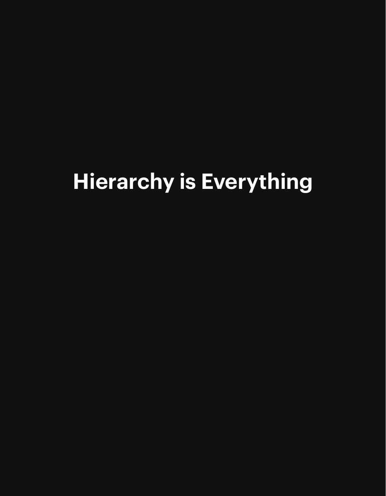
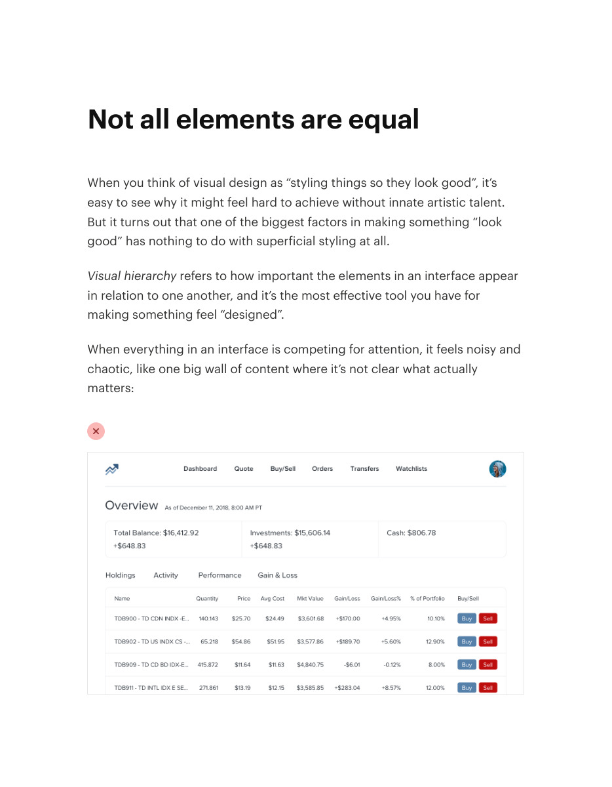
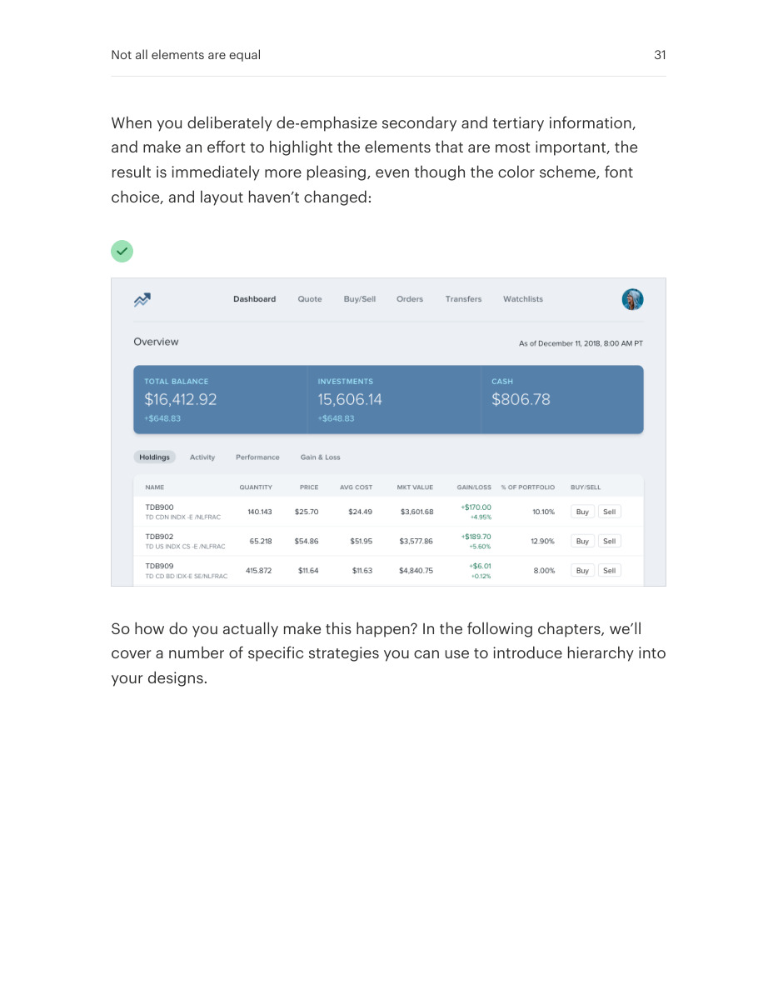

# Give important elements visual priority

## Apply this

- If everything competes for attention, identify the primary information and action.
- Reduce secondary text, contrast, or weight so the important content reads first.
- Check the first glance at realistic density; do not make necessary information illegible.

## Source

Source: `Refactoring UI v1.0.2.pdf`, version 1.0.2, PDF pages 29–31.
Apply this is new guidance; the source blocks below preserve the supplied pypdf extraction verbatim.
Page images preserve the original visual content, including text absent from extraction.

### Source outline

- Hierarchy is Everything (source page 29)
- Not all elements are equal (source page 30)

## Source pages

### Source page 29



```text
Hierarchy is Everything
```

### Source page 30



```text
Not all elements are equal
When you think of visual design as “styling things so they look good”, it’s
easy to see why it might feel hard to achieve without innate artistic talent.
But it turns out that one of the biggest factors in making something “look
good” has nothing to do with superficial styling at all.
Visual hierarchy refers to how important the elements in an interface appear
in relation to one another, and it’s the most effective tool you have for
making something feel “designed”.
When everything in an interface is competing for attention, it feels noisy and
chaotic, like one big wall of content where it’s not clear what actually
matters:

```

### Source page 31



```text
When you deliberately de-emphasize secondary and tertiary information,
and make an effort to highlight the elements that are most important, the
result is immediately more pleasing, even though the color scheme, font
choice, and layout haven’t changed:
So how do you actually make this happen? In the following chapters, we’ll
cover a number of specific strategies you can use to introduce hierarchy into
your designs.
Not all elements are equal 31
```
