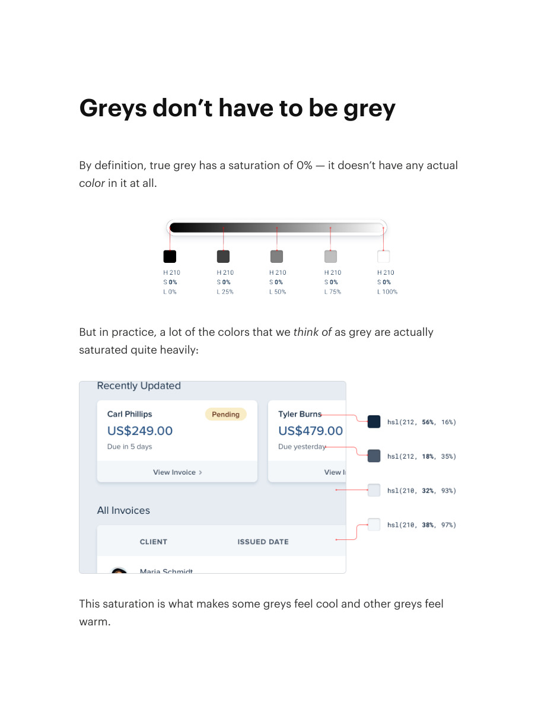
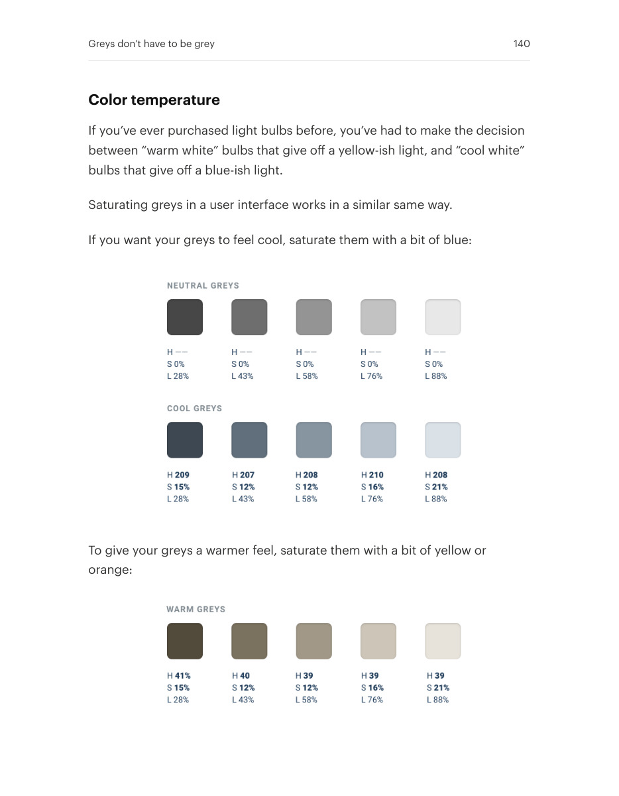
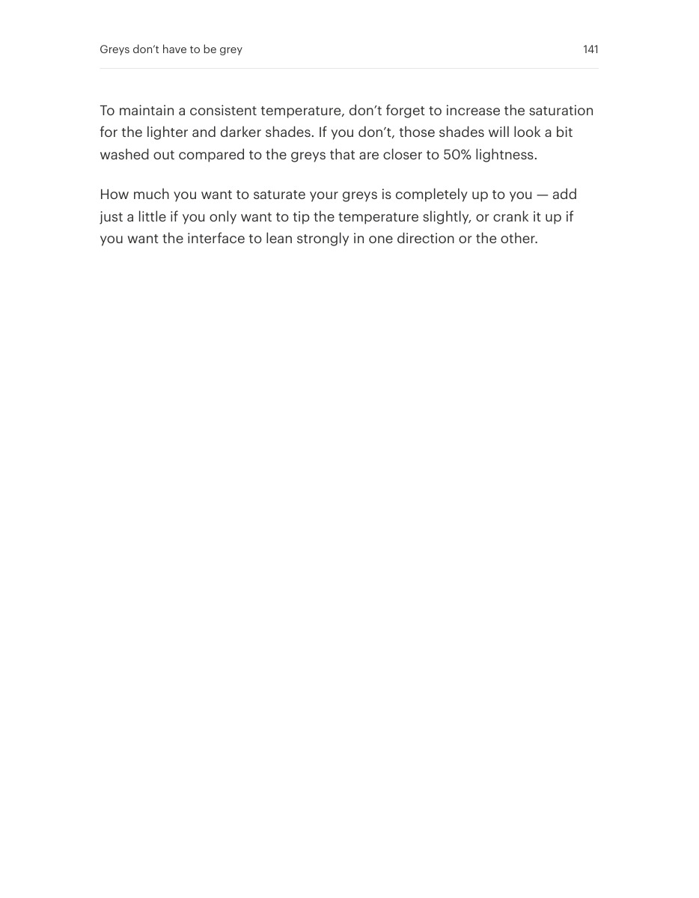

# Give neutrals a deliberate temperature

## Apply this

- If gray surfaces feel disconnected from the interface, try a restrained warm or cool tint.
- Keep the neutral ramp consistent with the surrounding palette.
- Compare text and surfaces together; avoid tints so strong that neutrals compete with accents.

## Source

Source: `Refactoring UI v1.0.2.pdf`, version 1.0.2, PDF pages 139–141.
Apply this is new guidance; the source blocks below preserve the supplied pypdf extraction verbatim.
Page images preserve the original visual content, including text absent from extraction.

### Source outline

- Greys don’t have to be grey (source page 139)
  - Color temperature (source page 140)

## Source pages

### Source page 139



```text
Greys don’t have to be grey
By definition, true grey has a saturation of 0% — it doesn’t have any actual
color in it at all.
But in practice, a lot of the colors that wethink of as grey are actually
saturated quite heavily:
This saturation is what makes some greys feel cool and other greys feel
warm.
```

### Source page 140



```text
Color temperature
If you’ve ever purchased light bulbs before, you’ve had to make the decision
between “warm white” bulbs that give off a yellow-ish light, and “cool white”
bulbs that give off a blue-ish light.
Saturating greys in a user interface works in a similar same way.
If you want your greys to feel cool, saturate them with a bit of blue:
To give your greys a warmer feel, saturate them with a bit of yellow or
orange:
Greys don’t have to be grey 140
```

### Source page 141



```text
To maintain a consistent temperature, don’t forget to increase the saturation
for the lighter and darker shades. If you don’t, those shades will look a bit
washed out compared to the greys that are closer to 50% lightness.
How much you want to saturate your greys is completely up to you — add
just a little if you only want to tip the temperature slightly, or crank it up if
you want the interface to lean strongly in one direction or the other.
Greys don’t have to be grey 141
```
