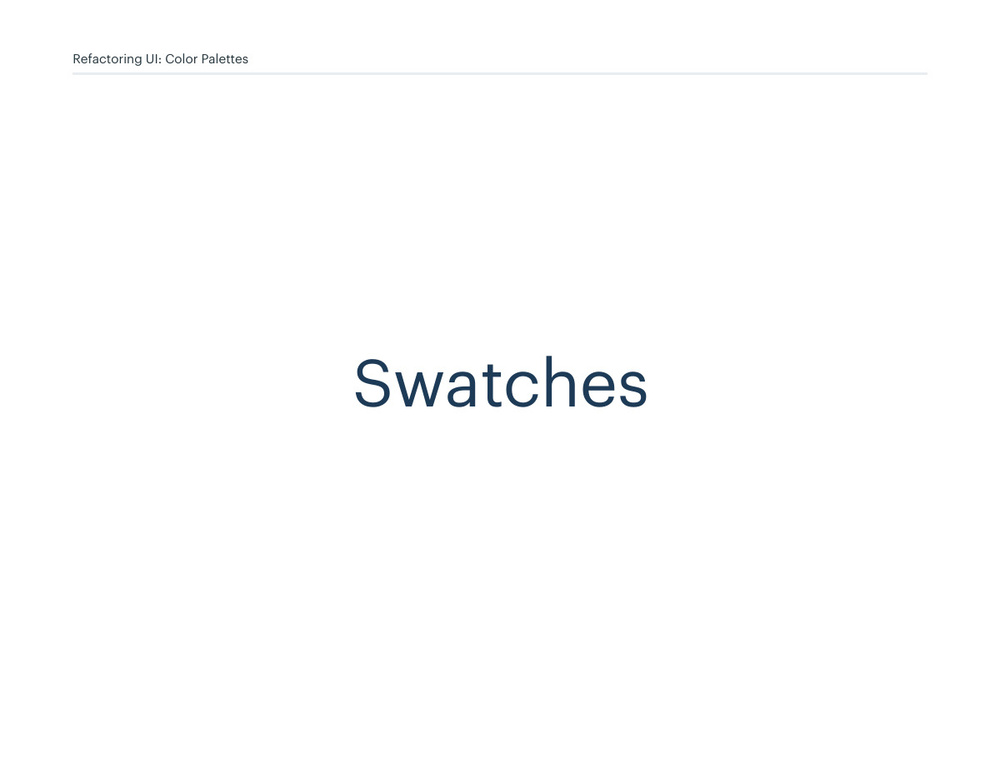
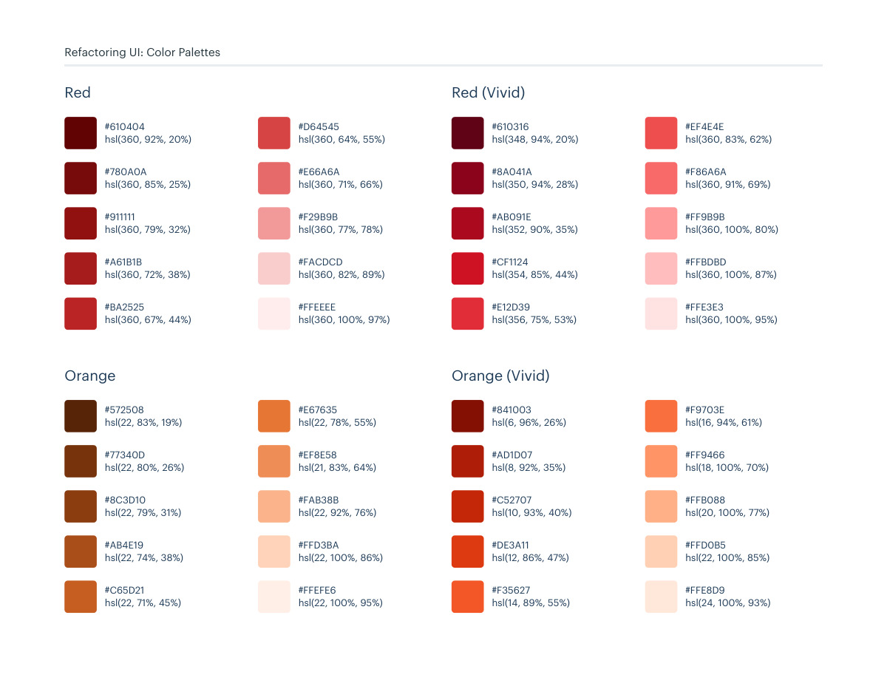
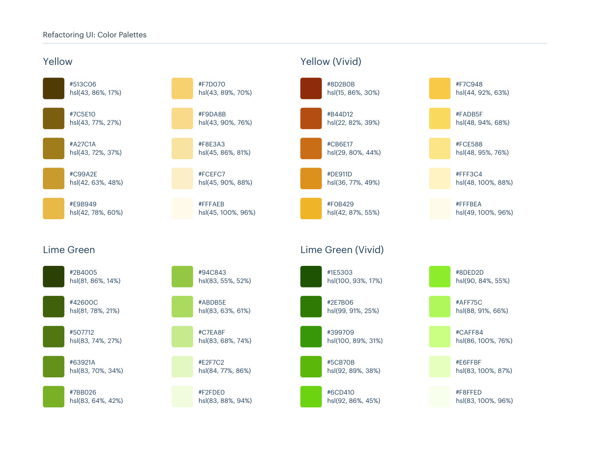

# Red, orange, yellow, and lime swatches

## Apply this

- If you need to extend an existing color system, compare the red, orange, yellow, and lime swatches in these pages.
- Select a coherent shade family and map it to existing semantic token roles; preserve palette-specific variants separately.
- Verify foreground/background contrast and temperature across components; same-named shades in a palette may differ from this swatch catalog.

## Source

Source: `Color Palettes v1.1.0.pdf`, version 1.1.0, PDF pages 144–146.
Apply this is new guidance; the source blocks below preserve the supplied pypdf extraction verbatim.
Page images preserve the original visual content, including text absent from extraction.

Palette originals retain source comments and trailing commas (JSONC), despite their `.json` extension.
The `.strict.json` companion removes only that syntax; keys and values remain unchanged.
- [swatches.json](../assets/swatches.json)
- [swatches.strict.json](../assets/swatches.strict.json)

## Source pages

### Source page 144



```text
Swatches
Refactoring UI: Color Palettes
```

### Source page 145



```text
Refactoring UI: Color Palettes
hsl(360, 92%, 20%)
#610404
hsl(360, 85%, 25%)
#780A0A
hsl(360, 79%, 32%)
#911111
hsl(360, 72%, 38%)
#A61B1B
hsl(360, 67%, 44%)
#BA2525
hsl(360, 64%, 55%)
#D64545
hsl(360, 71%, 66%)
#E66A6A
hsl(360, 77%, 78%)
#F29B9B
hsl(360, 82%, 89%)
#FACDCD
hsl(360, 100%, 97%)
#FFEEEE
Red
hsl(348, 94%, 20%)
#610316
hsl(350, 94%, 28%)
#8A041A
hsl(352, 90%, 35%)
#AB091E
hsl(354, 85%, 44%)
#CF1124
hsl(356, 75%, 53%)
#E12D39
hsl(360, 83%, 62%)
#EF4E4E
hsl(360, 91%, 69%)
#F86A6A
hsl(360, 100%, 80%)
#FF9B9B
hsl(360, 100%, 87%)
#FFBDBD
hsl(360, 100%, 95%)
#FFE3E3
Red (Vivid)
hsl(22, 83%, 19%)
#572508
hsl(22, 80%, 26%)
#77340D
hsl(22, 79%, 31%)
#8C3D10
hsl(22, 74%, 38%)
#AB4E19
hsl(22, 71%, 45%)
#C65D21
hsl(22, 78%, 55%)
#E67635
hsl(21, 83%, 64%)
#EF8E58
hsl(22, 92%, 76%)
#FAB38B
hsl(22, 100%, 86%)
#FFD3BA
hsl(22, 100%, 95%)
#FFEFE6
Orange
hsl(6, 96%, 26%)
#841003
hsl(8, 92%, 35%)
#AD1D07
hsl(10, 93%, 40%)
#C52707
hsl(12, 86%, 47%)
#DE3A11
hsl(14, 89%, 55%)
#F35627
hsl(16, 94%, 61%)
#F9703E
hsl(18, 100%, 70%)
#FF9466
hsl(20, 100%, 77%)
#FFB088
hsl(22, 100%, 85%)
#FFD0B5
hsl(24, 100%, 93%)
#FFE8D9
Orange (Vivid)
```

### Source page 146



```text
Refactoring UI: Color Palettes
hsl(15, 86%, 30%)
#8D2B0B
hsl(22, 82%, 39%)
#B44D12
hsl(29, 80%, 44%)
#CB6E17
hsl(36, 77%, 49%)
#DE911D
hsl(42, 87%, 55%)
#F0B429
hsl(44, 92%, 63%)
#F7C948
hsl(48, 94%, 68%)
#FADB5F
hsl(48, 95%, 76%)
#FCE588
hsl(48, 100%, 88%)
#FFF3C4
hsl(49, 100%, 96%)
#FFFBEA
Yellow (Vivid)
hsl(43, 86%, 17%)
#513C06
hsl(43, 77%, 27%)
#7C5E10
hsl(43, 72%, 37%)
#A27C1A
hsl(42, 63%, 48%)
#C99A2E
hsl(42, 78%, 60%)
#E9B949
hsl(43, 89%, 70%)
#F7D070
hsl(43, 90%, 76%)
#F9DA8B
hsl(45, 86%, 81%)
#F8E3A3
hsl(45, 90%, 88%)
#FCEFC7
hsl(45, 100%, 96%)
#FFFAEB
Yellow
hsl(83, 55%, 52%)
#94C843
hsl(83, 63%, 61%)
#ABDB5E
hsl(83, 68%, 74%)
#C7EA8F
hsl(84, 77%, 86%)
#E2F7C2
hsl(83, 88%, 94%)
#F2FDE0
hsl(81, 86%, 14%)
#2B4005
hsl(81, 78%, 21%)
#42600C
hsl(83, 74%, 27%)
#507712
hsl(83, 70%, 34%)
#63921A
hsl(83, 64%, 42%)
#7BB026
Lime Green
hsl(100, 93%, 17%)
#1E5303
hsl(99, 91%, 25%)
#2E7B06
hsl(100, 89%, 31%)
#399709
hsl(92, 89%, 38%)
#5CB70B
hsl(92, 86%, 45%)
#6CD410
hsl(90, 84%, 55%)
#8DED2D
hsl(88, 91%, 66%)
#AFF75C
hsl(86, 100%, 76%)
#CAFF84
hsl(83, 100%, 87%)
#E6FFBF
hsl(83, 100%, 96%)
#F8FFED
Lime Green (Vivid)
```
